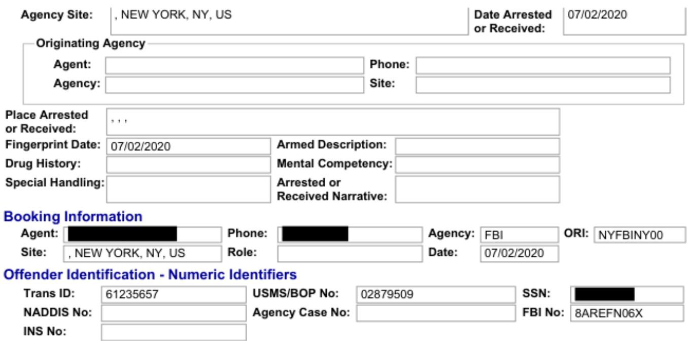

## MAXWELL, GHISLAINE

Trans ID: 61235657

FBI No: 8AREFN06X

DOB:

Package is Current

FBI Name: MAXWELL,GHISLAINE NOELLE

Date Arrested

Received: 07/08/2020 14:21:17

or Received: 07/02/2020

Charges:

6405 - Sexual Exploitati.

3622 - Transport Interst..

6405 - Sexual Exploitati..

5003 - Perury

3622 - Transport Interst...

5003 - Perjury

Personal History

## General Information

FBI Name:

FBINo:

8AREFN06X

Aliases

Trans ID: 61235657

MAX, G

Status:

JABS Updated

Package ID: F5C9BC0CBA14407D96D14A1BF0900815

Phone:

(R);

Address:

(R);

Bradford, NH US 03221

## Detention Information

Location:

Date: 07/02/2020

## Biographic Information

Gender:

Female

Race:

Hair:

White

Ethnicity:

Black

DOB:

Eye:

Brown

Height:

57"

Weight:142

Identifying Characteristics (NCIC Code, Description)

NONE

Marital Status:

Occupation:

Health Status:

Education:

Medications

NONE

Birth City:

Birth Country:

FRANCE

Birth State:

## Arrested or Received Information

Citizenship:

USA

Officer Name:

Phone:

Jurisdiction:

## Charges (Charge, Offense Date)

<table><tr><td rowspan=1 colspan=1>6405 - Sexual Exploitation of Minor - Sex Performance</td><td rowspan=1 colspan=1>07/02/2020</td></tr><tr><td rowspan=1 colspan=1>6405 - Sexual Exploitation of Minor - Sex Performance</td><td rowspan=1 colspan=1>07/02/2020</td></tr><tr><td rowspan=1 colspan=1>3622 - Transport Interstate for Sexual Activity</td><td rowspan=1 colspan=1>07/02/2020</td></tr><tr><td rowspan=1 colspan=1>3622 - Transport Interstate for Sexual Activity</td><td rowspan=1 colspan=1>07/02/2020</td></tr><tr><td rowspan=1 colspan=1>5003 - Perjury</td><td rowspan=1 colspan=1>07/02/2020</td></tr><tr><td rowspan=1 colspan=2>5003 - Perjury                                                                                 07/02/2020</td></tr></table>

Warrant Numbers

NONE

Agency:

FBI

ORI:

NYFBINY00

SDNY\_GM\_00000001

https://www.cjis.gov/jabs/query\_showPrinterFriendlyPersonalHistory.do?transactionId=61…. 7/22/2020

Identifying Documents NONE

Vehicle Information NONE

Incarceration Information NONE

Separatee Information NONE

Associates Information NONE

Immediate Family Information NONE

Limited official Use