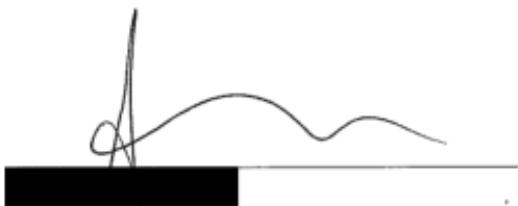

IN THE MATTER OF AN APPLICATION OF THE UNITED STATES OF AMERICA FOR AN ORDER AUTHORIZING THE USE OF A PEN REGISTER AND TRAP-AND-TRACE DEVICE ON A CERTAIN TELEPHONE

## SEALED APPLICATION

hereby affirms, under penalty of perjury, as follows:

I am an Assistant United States Attorney in the office of GeoffreyS. Berman, United States Attorney for the Southern District of New York, and I am familiar with this matter.

1. The Government is seeking an order pursuant to 18 U.S.C. 8 3123 authorizing the installation and use of a pen register and trap-and-trace device (the "Requested Pen-Trap'") for a period of sixty (60) days following the date of this order, on the following phone line (the "Target Phone") maintained by Verizon (the "Provider").

Phone number:

Subscriber Name:

2. The Government is seeking the Requested Pen-Trap in connection with a criminal investigation conducted by the Federal Bureau of Investigation (the "Investigating Agency") of FNU LNU and others known and unknown (the "Target Subjects"), in connection with possible violations of 18 U.S.C. 8 1591.

## Legal Authority

3. A "pen register" is "a device or process which records or decodes dialing, routing, addressing, or signaling information transmitted by an instrument or facility from which a wire or electronic communication is transmitted." 18 U.S.C. 8 3127(3). A "trap and trace device" is defined as "a device or process which captures the incoming electronic or other impulses which identify the originating number or other dialing, routing, addressing, and signaling information

reasonably likely to identify the source of a wire or electronic communication." 18 U.S.C.   
8 3127(4).

4. In the context of traditional phone communications, pen registers capture the destination phone numbers of outgoing calls and texts sent from a phone, while trap and trace devices capture the phone numbers of incoming calls and texts received by a phone. Similar principles apply to other kinds of wire and electronic communications, including Internet communications, which most phones today are used to send and receive in addition to phone communications.

5. On the Internet, data transferred between devices is not sent as a continuous stream, but rather the data are split into discrete "packets." Generally, a single communication is sent as a series of packets. When the packets reach their destination, the receiving device reassembles them into the complete communication. Each packet has two parts: a "header," which contains routing and control information, and a "payload," which generally contains user data.

6. In particular, a packet header reflects the following information:

• the source IP address1 from which the packet was sent and the destination IP address to which the packet is directed;

• the communications port associated with the packet, reflecting the type of

communication involved (e.g., web, email, FTP); and

• the date/time of the communication.

7. The information sought through the Requested Pen-Trap does not include the "contents" of communications within the meaning of the Wiretap Statute, as it does not include "information concerning the substance, purport, or meaning" of any communication. 18 U.S.C. s 2510(8). The Government is not requesting, and does not seek to obtain, the contents of any communications.2

## Certification and Request

8. I am familiar with the facts of this investigation from my review of relevant records and my discussions with the case agents involved. Based on those records and discussions, I hereby certify, pursuant to 18 U.S.C. 8 3123(a)(1), that the information likely to be obtained from the Requested Pen-Trap is relevant to the Investigating Agency's ongoing criminal investigation of the Target Subjects.

9. Accordingly, the Government requests that the Court enter an order authorizing the installation and use of the Requested Pen-Trap to collect the phone numbers and/or IP addresses and communications ports associated with any phone, text, or data communications to or from the Target Phone, along with the date, time, and duration (but not the contents) of the communication, for a period of 60 days.

10. The Government further requests, pursuant to 18 U.S.C. 88 3123(b)(2) and 3124(a)-(b), that the Order direct the Provider and any other person or entity proyiding wire or electronic communication service in the United States whose assistance may facilitate execution of this Order to furnish, upon service of the Order, any information, facilities, and technical assistance necessary to install the Requested Pen-Trap unobtrusively and with minimum disruption of normal service. Any entity providing such assistance shall be reasonably compensated by the Investigating Agency, pursuant to 18 U.S.C. 8 3124(c), for reasonable expenses incurred in providing facilities and assistance in furtherance of this Order.

11. The Government further requests that the Order direct that the information collected through the Requested Pen-Trap be furnished to the Investigating Agency at reasonable intervals during regular business hours for the duration of the Order.

12. The Government further requests that the Order direct the Provider to notify the Investigating Agency of any changes relating to the Target Phone, including changes to subscriber information, and to provide prior notice to the Investigating Agency before terminating service to the Target Phone.

13. The Government further requests, pursuant to 18 U.S.C. 8 3123(d), that the Provider and its agents and employees be directed to refrain from disclosing the Requested Pen-Trap or the existence of the underlying investigation, except as necessary to effectuate the Order, unless and until authorized by this Court, and that the Clerk of Court be directed to seal the Order (and this Application) until further order of this Court, except that copies may be retained by the United States Attorney's Office and the Investigating Agency.

The foregoing is affirmed under the penalties of perjury, pursuant to 28 U.S.C. 8 1746.

Dated: New York, New York June 27, 2019

  
Assistant United States Attorney Southern District of New York Telephone:

IN THE MATTER OF AN APPLICATION OF THE UNITED STATES OF AMERICA FOR AN ORDER AUTHORIZING THE USE OF A PEN REGISTER AND TRAP-AND-TRACE DEVICE ON A CERTAIN TELEPHONE

SEALED ORDER

WHEREAS an application has been made by an Assistant U.S. Attorney in the Southern District of New York, pursuant to 18 U.S.C. 88 3121-26, for an order authorizing the installation and use of a pen register and trap-and-trace device (the "Requested Pen-Trap") on the following phone line (the "Target Phone") maintained by Verizon (the "Provider"):

Phone number:

Subscriber Name: n/av

WHEREAS the applicant has certified that the information likely to be obtained from the Requested Pen-Trap is relevant to an ongoing criminal investigation conducted by the Federal Bureau of Investigation (the "Investigating Agency") of FNU LNU and others known and unknown in connection with possible violations of 18 U.S.C: 8 1591.

IT IS HEREBY ORDERED, pursuant to 18 U.S.C. 88 3121-26, that the Investigating Agency may direct the Provider to install the Requested Pen-Trap to identify the phone numbers and/or IP addresses and communications ports associated with any phone, text, or data communications to or from the Target Phone, along with the date, time, and duration (but not the contents) of such communications; 1

IT IS FURTHER ORDERED, pursuant to 18 U.S.C. 8 3123(c)(1), that the use of the Requested Pen-Trap is authorized for 60 days from the date of this Order;

IT IS FURTHER ORDERED, pursuant to 18 U.S.C. \$ 3123(b)(2), that the Provider furnish any information, facilities, and technical assistance necessary to accomplish the installation and operation of the Requested Pen-Trap unobtrusively and with a minimum of disruption of normal service;

IT IS FURTHER ORDERED that the results of the Requested Pen-Trap shall be furnished to the Investigating Agency at reasonable intervals during regular business hours for the duration of this Order;

IT IS FURTHER ORDERED that the Provider be compensated by the Investigating Agency for reasonable expenses incurred in executing this Order;

IT IS FURTHER ORDERED that the Provider notify the Investigating Agency of any changes relating to the Target Phone, including changes to subscriber information, and provide prior notice to the Investigating Agency before terminating service to the Target Phone; and

IT IS FURTHER ORDERED, pursuant to 18 U.S.C. 8 3123(b), that the Provider not disclose the Requested Pen-Trap or the existence of the underlying investigation to any person, except as necessary to effectuate this Order, unless or until otherwise ordered by the Court, and that this Order be sealed until otherwise ordered by this Court, except that copies may be

retained by the United States Attorney's Office for the Southern District of New York and the

Investigating Agency.

Dated: New York, New York June 27, 2019

S/Robert W. Lehrburger

THEHONORABLEROBERTW,LEHRBURGER UNITEDSTATESMAGISTRATEJUDGE SOUTHERN DISTRICTOFNEWYORK