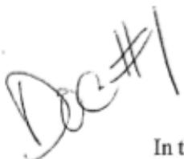
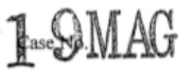
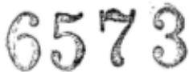
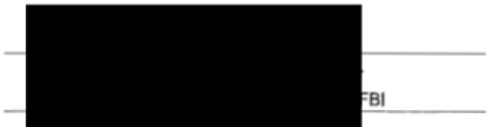
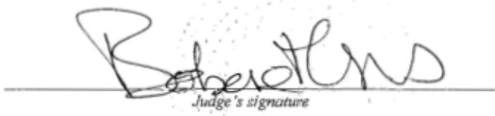
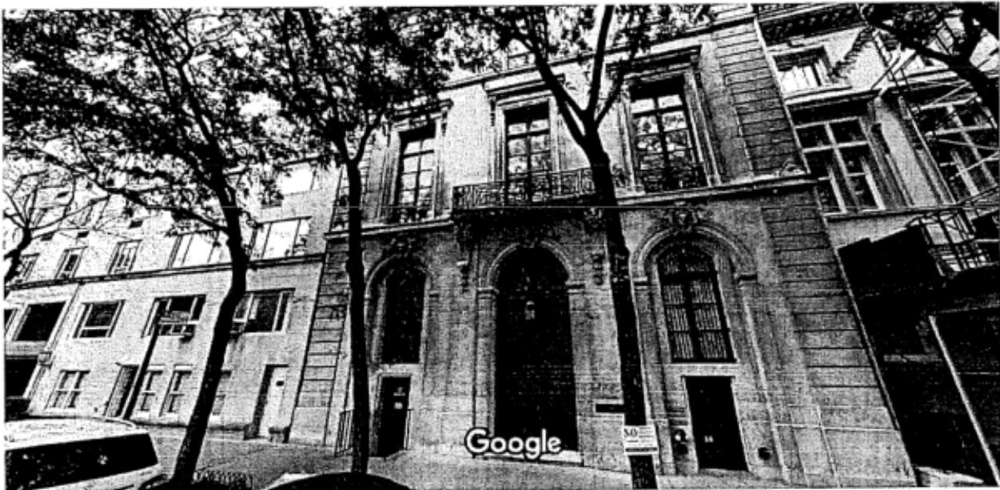
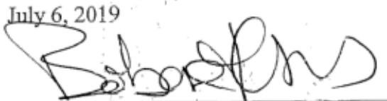
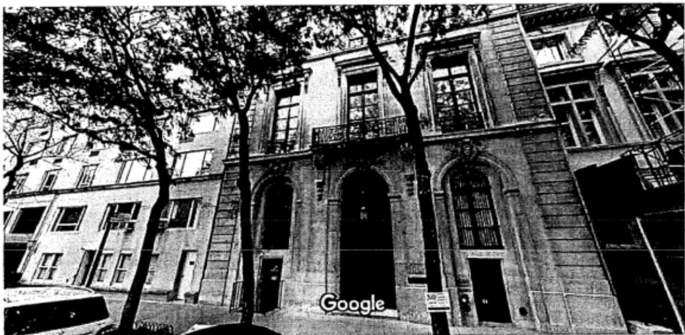

# UNITED STATES DISTRICT COURT

for the

Southern District of New York

In the Matter of the Search of (Briefly describe the property to be searched or identify the person by name and address)

See Attached Affidavit and its Attachment A

## APPLICATION FOR A SEARCH AND SEIZURE WARRANT

I, a federal law enforcement officer or an attoey for the goverment, request a search warrant and state under penaly ofperury thatIhave reason tobelieve that on the follwing person or prperty identi te erson or describe th property to be searched and give its location):

located in the Southern District of New York , there is now concealed (identify the person or describe the property to be seized):

See Attached Affidavit and its Attachment A

The basis for the search under Fed. R. Crim. P. 41(c) is (check one or more):

√vidence of a crime;

contraband, fruits of crime, or other items illegally possessed;

property designed for use, intended for use, or used in commiting a crime;

a person to be arrested or a person who is unlawfully restrained.

The search is related to a violation of:

Code Section(s)

Offense Description(s)

## 18U.S.C.SS 1591 and Sex trafficking of minors; sex trafficing conspiracy 371

The application is based on these facts:

See Attached Affidavit and its Attachment A

Continued on the attached sheet.

Delayed notice of days(give exact ending date if more than 30 days: ) is requested under 18 U.S.C. s 3103a, the basis of which is set forth on the attached sheet.

Sworn to before me and signed in my presence.

Date:

City and state: New York, NY

Hon. Barbare Moses, U.S. Magistrate Judge Pr'inted name and title

## UNITED STATES DISTRICT COURT SOUTHERN DISTRICT OF NEW YORK

In the Matter of the Application of the United States Of America for a Search and Seizure Warrant for the Premises Known and Described as 9 East 71st Street, New York, New York and Any Closed Containers/Items Contained Therein

TO BE FILED UNDER SEAL

Agent Affidavit in Support of Application for Search and Seizure Warrant

SOUTHERN DISTRICT OF NEW YORK) s.:

being duly sworn, deposes and says:

## I. Introduction

## A. Affiant

1. I have been a Special Agent with the Federal Bureau of Investigation ("FBI") since 2017. During that time, I have participated in numerous investigations and prosecutions of crimes against children, including the sex trafficking of minors. I have also participated in the execution of multiple search warrants.

2. I make this Affidavit in support of an application pursuant to Rule 41 of the Federal Rules of Criminal Procedure for a warrant to search the premises specified below (the "Subject Premises") for the purpose of photographing, video-recording or otherwise documenting the appearance of its interior, and to seize the items and information described in Atachment A. This affidavit is based upon my personal knowledge; my review of documents and other evidence; and my conversations with other law enforcement personnel. Because this affidavit is being submitted for the limited purpose of establishing probable cause, it does not include all the facts that I have learned during the course of my investigation. Where the contents of documents and the actions, statements, and conversations of others are reported herein, they are reported in substance and in part, except where otherwise indicated.

## B. The Subject Premises

3. The Subject Premises are particularly described as a nearly 19,000 square foot multi-story, single-family residence located at 9 East 71st Street, New York, New York, and include all locked and closed containers found therein. As detailed further herein, the Subject Premises is believed to be owned, possessed and controlled by JEFFREY EPSTEIN, a target subject of this investigation. A photograph of the front entrance to the Subject Premises is included below:

## C. The Target Subject and the Subject Offenses

4. The Target Subject of this investigation is JEFFREY EPSTEIN.

5. For the reasons detailed below, I believe that there is probable cause to believe that the Subject Premises contain evidence, fiuits, and instrumentalities of violations of Title 18, United States Code, Section 1591 (sex trafficking of minors) and Title 18, United States Code, Section 371 (sex trafficking conspiracy) (the "Subject Offenses") by the Target Subject.

## II. Probable Cause

A. Probable Cause Regarding the Target Subject's Commission of the Subject Offenses

6. On or about July 2, 2019, a grand jury in this District returned an Indictment charging JEFFREY EPSTEIN with the Subject Offenses. A copy of the Indictment is attached hereto as Exhibit A and is incorporated by reference.

## B. Probable Cause Justifying Search of the Subject Premises

7. As set forth in Exhibit A, from at least in or about 2002, up to and including at least in or about 2005, JEFFREY EPSTEIN sexually abused multiple minor girls in the Southern District of New York and elsewhere. During that time and continuing to the present, EPSTEIN possessed and controlled the Subject Premises, which is described in Exhibit A as "the New York Residence."

8. As further set forth in paragraphs 8 through 10 of Exhibit A, from at least in or about 2002, up to and including at least in or about 2005, EPSTEIN sexually abused numerous minor victims at the Subject Premises. In particular, and as alleged in the Indictment, when a victim arrived at the Subject Premises, she would be escorted to a room inside the Subject Premises with a massage table, where she would perform a massage on EPSTEIN. The victims, who were as young as 14 years of age, were told by EPSTEIN or other individuals to partially or fully undress before beginning the "massage." During the encounter, EPSTEIN would escalate the nature and scope of physical contact with his victim to include, among other things, sex acts such as groping and direct and indirect contact with the victims' genitals. EPS'TEIN typically would also masturbate during these sexualized encounters, ask victims to touch him while he masturbated, and touch victims' genitals with his hands or with sex toys. Following each encounter, EPSTEIN or one of his employees or associates paid the victim in cash.

## CONFIDENTIAL

9. As set forth in paragraphs 12 through 13 of Exhibit A, to further facilitate his ability to abuse minor girls in New York, JEFFREY EPSTEIN, the defendant, asked and enticed certain of his victims to recruit additional minor girls to perform "massages" and similarly engage in sex acts with EPSTEIN. When a victim would recruit another minor girl for EPSTEIN, he paid both the victim-recruiter and the new victim hundreds of dollars in cash. EPSTEIN knew that his victims were underage, including because certain victims told him their age.

10. One of the victims identified in paragraph 22 of Exhibit A is Victim-1. As part of the FBI's investigation of EPSTEIN, other law enforcement officers and I have interviewed Victim-1.1 I know from my personal participation of interviews with Victim-1, my conversations with other law enforcement officers who have interviewed Victim-1, and my review of notes and reports of other interviews with Victim-1 that Victim-1 has provided the following information, in substance and in part:

a. Between approximately 2002 and 2005, EPSTEIN sexually abused Victim-1 on multiple occasions in the Subject Premises. This sexual abuse all occurred when Victim-1 was under the age of 18.

b. During that same period, Victim-1 observed multiple floors of the Subject Premises and numerous individual rooms within the Subject Premises. Victim-1 has provided detailed descriptions of certain aspects of the interior of the Subject Premises, including Victim-1's memory of specific details regarding the layout, furnishings, decorations, and floor pattern of various areas within the Subject Premises.

11. I know from my review of publicly available corporate and property records that at all times relevant to the Subject Offenses as alleged in the Indictment, the Subject Premises was owned by Nine East 71st Street Corporation (the "Corporation"). The President of the Corporation is listed as JEFFREY EPSTEIN, and no other officers or occupants are identified on the Corporation paperwork. In or around December 2011, the Subject Premises was transferred from the Corporation to another corporate entity, Maple, Inc., which is registered in the U.S. Virgin Islands, where EPSTEIN was then known to and continues to reside. Though no officer of Maple, Inc., is identified in the transfer paperwork, the signature of both the buyer and seller in the transaction appear to be the same. Moreover, the deed lists the consideration for the transfer of the Subject Premises as \$10, an amount facially inconsistent with a fair market transfer to a third party.

12. I know from my participation in this investigation that EPSTEIN has continued to possess and control the Subject Premises from at least in or about 2002 to the present. In particular, I know from my review of Sex Offender Registration records that EPSTEIN presently lists the Subject Premises as one of his residences. Moreover, as described in paragraph 11, above, although ownership of Subject Premises was transferred from one corporate entity to another in December 2011, both corporations appear to be under EPSTEIN's control, and EPSTEIN appears to remain the sole owner and occupant of the Subject Premises.

13. Additionally, although Victim-1 has not been in the·Subject Premises since in or around 2005, based on my review of publicly available records maintained by the New York City Department of Buildings ("DOB"), it does not appear that there have been any significant or structural renovations to the interior of the Subject Premises since that time. In particular, the DOB reflects only three approved alteration permits for the Subject Premises, one in or around 2011 which authorized façade restoration but expressly noted that there would be "no change to occupancy, use egress or bulk," and two permitting the "installation of heavy duty sidewalk shed" outside of the Subject Premises at various points, but similarly noting that there would be "no changes in use, egress or occupancy." As such, while it is possible that certain interior decorations have changed since 2005, it is probable that structural components of the interior, such as Victim-1's description of the layout of rooms and floors, among other details, would remain the same.

## II. Conclusion and Ancillary Provisions

14. Based on the foregoing, I respectfully submit that there is probable cause to believe that photographing, video-recording, and otherwise documenting the appearance of the interior of the Subject Premises, and seizing the items described in Attachment A, will yield evidence of the Subject Offenses. In particular, evidence depicting the interior of the Subject Premises and reflecting the occupancy, ownership, layout, furnishings, decorations, and floor pattern of the Subject Premises will corroborate Victim-1's account of EPSTEIN's commission of the Subject Offenses. I further submit that there is probable cause to believe that such evidence will be located within the Subject Premises and therefore request the court to issue a warrant to seize the items and information specified in Attachment A to this affidavit and to the Search and Seizure Warrant.

  
Special Agent Federal Bureau of Investigation

Sworn to before me on July6,2019

THE HONORABLEBARBARAMOSES UNITEDSTATESMAGISTRATEJUDGE

# ATTACHMENTA

## I. Premises to be Searched—Subject Premises

1. The premises to be searched (the "Subject Premises") are described as a nearly 19,000 square foot multi-story single-family residence located at 9 East 71st Street, New York, New York, and include all locked and closed containers found therein. A photograph of the front entrance to the Subject Premises is included below:

## II. Items to Be Seized

1. This warrant authorizes executing agents to photograph, video record and otherwise document the ful interior of the Subject Premises, including any items, furnishings, or possessions therein.

2. In addition, this warrant authorizes the seizure of certain evidence, fruits, and instrumentalities of violations of Title 18, United States Code, Sections 1591 (sex trafficking of minors) and 371 (sex trafficking conspiracy) (the "Subject Offenses'") described as follows:

a. Evidence concerning occupancy or ownership of the Subject Premises, including utility and telephone bills, mail envelopes, addressed correspondence, diaries, statements, identification documents, address books, telephone directories, and photographs of its occupant(s).

b. Evidence concerning the layout, furnishings, decorations, and floor pattern of the Subject Premises, including photographs and blueprints of the Subject Premises.

## EXHIBIT A

# 19CRM 490

# COUNT ONE (Sex. Trafficking Conspiracy)

The Grand Jury charges:

## OVERVIEW

1. As set forth herein, over the course of many years, JErFREy EPsTEIN, the defendant, sexually exploited and. abused dozens of minor girls at his homes in Manhattan, New York, and Palm Beach, Florida, among other locations.

2. In particular, from at least in or about 2002, up to and including at least in or about 2005, JEFFREY EPSTEIN, the defendant, enticed and recruited, and caused to be enticed and recruited, minor girls to visit his mansion in Manhattan, New York (the "New York Residence") and his estate in Palm Beach, Florida (the "Palm Beach Residence") to engage in sex acts with him, after which he would give the victims hundreds of dollars in cash. Moreover, and in order to maintain and increase his supply of victims, EpsTEiN also paid certain of his victims to recruit additional girls to be similarly abused by EPsTEIN. In this way, EpsrEin created a vast network of underage victims for him to sexually exploit in. locations including New York and Palm Beach.

3. The victims described herein were as young as 14 years oId at the time they were abused by JEFFREY EPsTEIN, the defendant, and were, for various reasons, often particularly vulnerable to exploitation. EPsTEIN intentionally sought out minors and knew that many of his victims were in fact under the age of 18, including because, in some instances, minor victims expressly told him their age.

4. In creating and maintaining this network of minor victims in multiple states to sexually abuse and exploit, JEFFREY EPsTEIN, the defendant, worked and conspired with others, including employees and associates who facilitated his conduct by, among other things, contacting victims and scheduling their sexual encounters with EPsTEIN at the New York Residence and at the Palm Beach Residence.

## FACTUAL BACKGROUND

5.1 During all time periods charged in this Indictment, JEFFREY EPsTEIN, the defendant, was a financier with multiple residences in the continental United states, including the New York Residence'and the Palm Beach Residence.

6. Beginning in at least 2002, JEFFREY EPsTEIN, the defendant, enticed and recruited, and caused to be enticed and recruited, dozens of minor girls to engage in sex acts with him, after which EPsrEIN paid the victims hundreds of dollars in cash, at the New York Residence and the Palm Beach Residence.

7: In both New York and Florida, JErFREY EPsTEIN, the defendant, perpetuated this abuse in similar ways. victims were initially recxuited to provide "massages" to EpsTEIN, which would be performed nude or partially nude, would become increasingly sexual in nature, and would typically include one or more sex acts. EpsTEIN paid his victims hundreds of dollars in cash for each encounter. Moreover, EPsTEIN actively encouraged certain of his victims to recruit additional girls to be similarly sexually abused. EpsTEin incentivized his victims to become recruiters by paying these victim-recruiters hundreds of dollars for each girl that they brought to EpsTEIN. In so doing, EpsTEiN maintained a steady supply of new victims to exploit.

## The New York Residence

8. At all times relevant to this Indictment, JEFEREy EPsreiN, the defendant, possessed and controlled a multi-story private residence on the Upper East Side of Manhattan, New York, i.e., the New York Residence. Between at least in or about 2002 and in or about 2o05, EpsTEIN abused numerous minor victims at the New York Residence by causing these victims to be recruited to engage in paid sex acts with him.

she typically would be escorted to a room with a massage table, where she would perform a massage on JEFFREY EPsTEIN, the defendant. The victims, who were as young as 14 years of age, were told by EPsTEIN or other individuals to partially or fully undress before beginning the "massage." During the encounter, EpsTEIN would escalate the nature and scope of physical contact with his victim to include, among other things, sex acts such as groping and direct and indirect contact with the victim's genitals. EpsTEIN typically would also masturbate during these sexualized encounters, ask victims to touch him while he masturbated, and touch victims' genitals with his hands or with sex toys.

10. In connection with each sexual encounter, JEFFREr EPsrEiN, the defendant, or one of his employees or associates, paid the victim in cash. victims typically were paid hundreds of dollars in cash for each encounter.

11. JEFEREY EPsTEIN, the defendant, knew that many of his New York victims were underage, including because certain victims told him their age. Fuither, once these minor victims were recruited, many were abused by EPsTEiN on multiple subsequent occasions at the New York Residence. EPsTEIn sometimes personally contacted vi.ctims to schedule appointments at the New York Residence. In other instances, EPsTEiN directed employees and associates, including a New York-based employee. ("Employee-1"), to communicate with victims via phone to arrange for these victims to return to the New York Residence for additional sexual encounters with EPsTEIN.

12. Additionallyr and to further facilitate his ability to abuse minor girls in New York, JEFFREY EPsTEIN, the defendant, asked and enticed certain of his victims to recruit additional girls to perform "massages" and similarly engage in sex acts with EpsTEIN. when a victim would recruit another girl for EpsrEiN, he paid both the victim-recruiter and the new victim hundreds of dollars in cash. Through these victimrecrulters, EpsTEIN gained access to and was able to abuse dozens of additional minor girls.

13. In particular, certain recruiters brought dozens of additional minor girls to the New York Residence to give massages to and engage in sex acts with JEFFREY EpsTEIN, the defendant. EPsTEIN encouraged victims to recruit additional girls by offering to pay these victim-recruiters for every additional girl they brought to EPsTEIN. when a victimrecruiter accompanied a new minor victim to the New York Residence, both the victim-recruiter and the new minor victim were paid hundreds of dollars by EpsTEiN for each encounter. Ir addition, certain victim-recruiters xoutinely scheduled these

encounters through Employee-1, who sometimes asked.the

recruiters to bring a specific minor girl for EpsTEIn.

The Palm Beach Residence

14. In addition to recruiting and abusing minor gixls

in New York, JEFEREY EPsTEIN, the defendant, created a similar

network of minor girls to victimize in Palm Beach, Florida,

where EpsTEiN owned, possessed and controlled another large

residence, i.e., the Palm Beach Residence. EPsTEIN frequently

traveled from New York to Palm Beach by private jet, before

which an employee or associate would ensure that minor victims

were available for encounters upon his arrival in Florida.

15. At the Palm Beach Residence, JErFREY EPsTEIN, the

defendant, engaged in a similar course of abusive conduct.

when a victim initially arrived at the Palm Beach Residence, she

would be escorted to a room, sometimes by an employee of

EPsTEin's, including, at times, two assistants ("Employee-2" and

"Employee-3") who, as described herein, were also responsible

for scheduling sexual encounters with minor victims. Once

insider. the victim would provide a nude or'semi-nude massage for

EPsTEIN, who would himself typically be naked. During these

encounters, EPsrEiN would escalate the nature and scope of the

physical contact to include sex acts such as groping and direct

and indirect contact with the victim's genitals. EpsrEIN would

also typically masturbate during these encounters, ask victims to touch him while he masturbated, and touch victims' genitals with his hands or with sex toys.

16. In connection with each sexual encounter, JEFFREY EPsrEIN, the defendant, or one of his employees or associates, paid the victim in cash. victims typically were paid hundreds of dollars for each encounter.

17. JEFFREY EPsTEIN, the defendant, knew that certain of his victims were underage, including because certain victims told him their age. In addition, as with New York-based victims, many Florida victims, once recruited, were abused by JEFFREY EPsTEIN, the defendant, on multiple additional occasions.

18. JEFFREY EPsTEIN, the defendant, who during the relevant time period was frequently in New York, would arrange for Employee-2 or other employees to contact victims by phone in advance of EPsTEIN's. travel to Florida to ensure appointments were scheduled for when he arrived. In particular, in certain instances, Employee-2 placed phone calls to minor victims in Florida to schedule encounters at the Palm Beach Residence. At the time of certain of those phone calls, EPsTEIN and Employee-2 were in New York, New York. Additionally, certain of the individuals victimized at the Palm Beach Residence were contacted by phone by Employee-3 to schedule these encounters.

19. Moreover, as in New York, to ensure a steady stream of minor victims, JEFEREY EPsTEIN, the defendant, asked and enticed cextain victims in Florida to recruit other girls to engage in sex acts. EpsrEIN paid hundreds of dollars to victimrecruiters for each additional girl they brought to the Palm Beach Residence.

## STATUTORY ALLEGATIONS

20. From at least in or about 2002, up to and including in or about 20o5, in the Southern District of New York and elsewhere, JEFFREY EPsTEIN, the defendant, and others known and unknown, willfully and knowingly did combine, conspirer confederate, and agree together and with each other to commit an offense against the United states, to wit, sex trafficking of minors, in violation of Title 18, United states Code, Section. 1591(a) and (b).

21. It was a part and object of the conspiracy that JEFFREY EPsTEIN, the defendant, and others known and unknown, would and did, in and affecting interstate and foxeign commerce, recruit, enticer harbor, transport, provide, and obtain, by any means a person, and to benefit, financially and by receiving anything of value, from participation in a venture which has engaged in any such act, knowing that the person had not attained the age of l8 years and would be caused to engage in a commercial sex act, in violation of Title 18, United states Code, Sections 1591(a) and (b)(2).

## overt Acts

22. In furtherance of the conspiracy and to effect the illegal object thereof, the following overt acts, among others, were committed in the Southern District of New York and elsewhere:

a. In or about 2004, JEFFREY EPsTEIN, the defendant, enticed and recruited multiple minor victims, including minor victims identlfied herein as Minor victim-l, Minor yictim-2, and Minor victim-3, to engage in sex acts with EPsTEIN at his residences in Manhattan, New York, and Palm. Beach, Florida, after which he provided them with hundreds of dollars in cash for each encounter.

b. In or about 2002, Minor victim-1 was recruited to engage in sex acts with EpsTEiN and was repeatedly. sexually abused by EPsTEIN at the New York Residence over a period of years and was paid hundreds of dollars for each encounter. EpsTEIN also encouraged and enticed Minor Victim-1 to recruit other girls to engage in paid sex acts, which she did. EPsTEIN asked Minor Victim-1 how old she was, and Minor victim-1 answered truthfully.

c. In or about 2004, Employee-1, located in the Southern District of New York, and on behalf of EPsrEINr placed a telephone call to Minor victim-1. in order to schedule an appointment for Minor victim-1 to engage in paid sex acts with EPSTEIN.

d. In or about 2004, Minor Victim-2 was recruited to engage in sex acts with EpsTEiN and was repeatedly sexually abused by EPsTEIN at the Palm Beach Residence over a period of years and was paid hundreds of dollars after each encounter. EPsTEIN also encouraged and enticed Minor victim-2 to recruit other girls to'engage in paid sex acts, which she did.

e. In or about 2005, Employee-2, located in the Southern District of New York, and on behalf of EpsrEIN, placed a telephone call to Minor victim-2 in order to schedule an appointment for Minor victim-2 to engage in paid sex acts with EPSTEIN.

recruited to engage in sex acts with EpsTEiN and was repeatedly sexually abused by EPsTEIN at the Palm Beach Residence over a period of years and was paid hundreds of dollars for each encounter. EpsTEIN also encouraged and enticed Minor victim-3 to recruit other girls to engage in paid sex acts, which she did. EPsTEIN asked Minor Victim-3 how old she was, and Minor victim-3 answered truthfully.

g. In or about 2005, Employee-2, located in the Southern District of New York, and on behalf of EPsTEIN, placed a telephone call to Minor victim-3 in Florida in order to schedule an appointment for Minor victim-3 to engage in paid sex acts with EPSTEIN.

telephone call to Minor victim-3 in order to schedule an appointment for Minor victim-3 to engage in paid sex acts with' EPSTEIN.

(Title 18, United States Code, Section 371.)

## COUNT TWO (Sex Trafficking)

The Grand Jury further charges:

23. The allegations contained in paragraphs'1.

through 19 and 22 of this Indictment are repeated and realleged as if fully set forth within.

24. Exom at least in or about 2002, up to. and including in or about 2oo5, in the Southern District of New York, JEFFREY EPSTEIN, the'defendant, willfully and knowinglyr in and affecting interstate and foreign commerce, did recruit, entice, harbor, transport, provide, and obtain by any means a person, knowing that the person had not attained the age of 18 years and would be caused to engage in a commercial sex act, and 1 did aid and abet the same, to wit, EPsTEiN recruited, enticed, harbored, transported, provided, and obtained numerous

individuals·who were less than 18 years old, including but not limited to Minor victim-1, as described above, and who were then caused to engage in at least one commercial sex act in Manhattan, New York.

(Title 18, United. States Code, Sections 1591(a), (b)(2), and 2.)

## FORFEITURE ALLEGATIONS

25. As a result of committing the offense alleged in Count Two of this Indictment, JEFFREY EPsTEIN, the defendant, shall forfeit to the United states, pursuant to Title 18, United States Code, Section 1594(c)(1), any property, real and personal, that was used or intended to be used to commit or to facilitate the commission of the offense alleged in Count Two, and any property, real or personal, constituting or derived from any proceeds obtained, directly or indirectlyr as a result of the offense alleged in Count Two, or any property traceable to such property, and the following specific property:

a. The lot or parcel of land, together with its buildings, appurtenances, improvements, fixtures, attachments and easements, located at 9 East 71st Street, New York, New York, with block number 1386 and lot number 10, owned by Maple, Inc.

## Substitute Asset Provision

26. If any of the above-described forfeitable

property, as a result of any act or omission of the defendant:

(a) cannot be located upon the exercise of due diligence;

(b) has been transferred or sold to, or deposited with, a third person;

(c) has been placed beyond the jurisdiction of the Court;

(d), has been substantially diminished in value; or

(e) has been commingled with other property which cannot be subdivided without difficulty;

it is the intent of the United States, pursuant to 21 U.S.C. s 853(p) and 28 U.s.C. s 2461(c), to seek forfeiture of any other property of the defendant up to the value.of the above forfeitable property.

(Title 18, United States Code, Section 1594; Title 21, United States Code, Section 853(p); and Title 28, United States Code, Section 2461.)

tmkas FOREPERSON

Aoy . B GEOFFREY S. BERMAN United states Attorney

Form No.USA-33s-274 (Ed.9-25-58)

UNITED STATES DISTRICT COURT SOUTHERN DISTRICT OF NEW YORK

UNITED STATES OF AMERICA

JEFFREY EPSTEIN,

Defendant.

## INDICTMENT

(18 U.s.C. ss 371, 1591(a),(b)(2), and2)

GEOFFREY S. BERMAN

United States Attorney

Foreperson