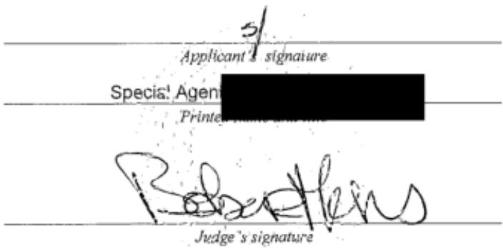
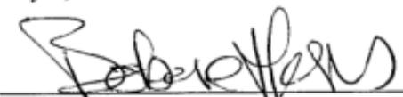
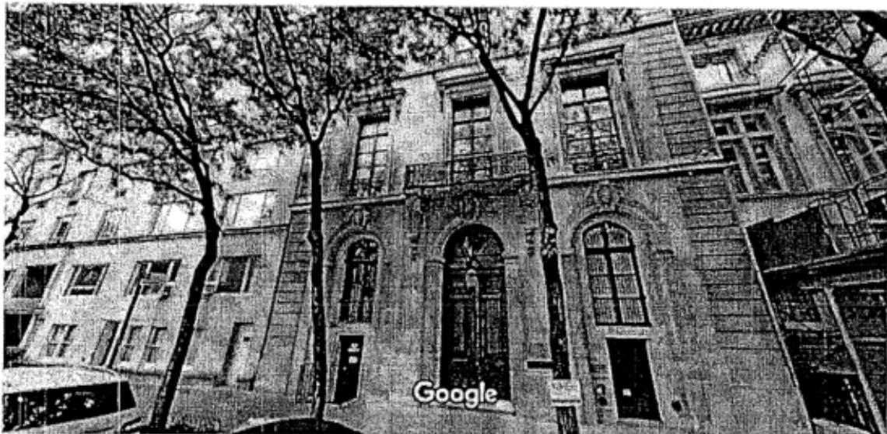

# UNITED STATEs DISTRICT COURT

for the

Southern District of New York

In the Matter of the Search of (Briefly describe the property to be searched or identify the person by name and address)

See Attached Affidavit and its Attachment A

caMAG

6571

## APPLICATION FOR A SEARCH AND SEIZURE WARRANT

I, a federal law enforcement officer or an attorey for the government, request a search warant and state under penalty ofperury that Ihave reason to believe that on the following person or property ideni the person or escribe the property to be searched and give its location):

located in the Southern District of New York , there is now concealed (identify the person or describe the property to be seized):

See Attached Affidavit and its Attachment A

The basis for the search under Fed. R. Crim. P. 41(c) is (check one or more):

kvidence of a crime;

bontraband, fruits of crime, or other items illegally possessed;

property designed for use, intended for use, or used in committing a crime;

a person to be arrested or a person who is unlawfully restrained.

The search is related to a violation of:

Code Section(s)

Offense Description(s)

18 U.S.C. SS 1591 and Sex trafficking of minors; sex trafficking conspiracy   
371

The application is based on these facts:

See Attached Affidavit and its Attachment A

Continued on the attached sheet.

Delayed notice of days (give exact ending date if more than 30 days: ) is requested under 18 U.S.C. s 3103a, the basis of which is set forth on the attached sheet.

Sworn to before me and signed in my presence.

Date: 07/07/2019

City and state:New York, NY

Hon. Barbara Moses, U.S. Magistrate Judge Printed name and title

CONFIDENTIALefeneem0 e)

## UNITED STATES DISTRICT COURT SOUTHERN DISTRICT OF NEW YORK

In the Matter of the Application of the United States Of America for a Search and Seizure Warrant for Compact Discs marked with FBI evidence numbers 15, 16, 17, 18, and 22, Seized from 9 East 71st Street, New York, NY on or about July 7, 2019, and Any Files or Media Stored Therein

TO BE FILED UNDER SEAL

Agent Affidavit in Support of Application for Search and Seizure Warrant

SOUTHERN DISTRICT OF NEW YORK) ss.:

being duly sworn, deposes and says:

## I. Introduction

## A. Affiant

1. I have been a Special Agent with the Federal Bureau of Investigation ("FBI") since 2012. As such, I am a "federal law enforcement officer" within the meaning of Federal Rule of Criminal Procedure 41(a)(2)(C), that is, a government agent engaged in enforcing the criminal laws and duly authorized by the Attorney General to request a search warrant. I have been employed by the FBI for three and a half years, and I am currently assigned to investigate violations of criminal law relating to the sexual exploitation of children. I have gained expertise in this area through classroom training and daily work related to these types of investigations. As part of my responsibilities, I have been involved in the investigation of sex trafficking cases, and have been involved in search warrants for electronic storage media.

2. I make this Afidavit in support of an application pursuant to Rule 41 of the Federal Rules of Criminal Procedure for a warrant to search the storage media specified below (the "Subject Devices") for the purpose of seizing the items and information described in Attachment A. This affidavit is based upon my personal knowledge; my review of documents and other evidence; and my conversations with other law enforcement personnel. Because this affidavit is being submitted for the limited purpose of establishing probable cause, it does not include all the facts that I have learned during the course of my investigation. Where the contents of documents and the actions, statements, and conversations of others are reported herein, they are reported in substance and in part, except where otherwise indicated.

## B. The Subject Devices

3. The Subject Devices are particularly described as compact discs stored in containers marked with FBI evidence numbers 15, 16, 17, 18, and 22, seized from the residence of JEFFREY EPSTEIN located at 9 East 71st Street, New York, New York (the "Epstein Residence"), on or about July 7, 2019.

## C. The Target Subject and the Subject Offenses

4. The Target Subject of this investigation is JEFFREY EPSTEIN.

5. For the reasons detailed below, I believe that there is probable cause to believe that the Subject Devices contain evidence, fruits, and instrumentalities of violations of Title 18, United States Code, Section 1591 (sex trafficking of minors); Title 18, United States Code, and Section 371 (sex trafficking conspiracy)(the "Subject Offenses'") by the Target Subject.

## II. Probable Cause

6. On or about July 2, 2019, a grand jury in this District returned an Indictment charging JEFFREY EPSTEIN with violations of Title 18, United States Code, Section 1591 (sex trafficking of minors); and Title 18, United States Code, Section 371 (sex trafficking conspiracy). A copy of the Indictment is attached hereto as Exhibit A and is incorporated by reference.

The Indictment and Victim-1

7. As set forth in Exhibit A, from at least in or about 2002, up to and including at least in or about 2005, JEFFREY EPSTEIN sexually abused multiple minor girls in the Southern District of New York and elsewhere. During that time and continuing to the present, EPSTEIN possessed and controlled the Epstein Residence, which is described in Exhibit A as "the New York Residence."

8. As further set forth in paragraphs 8 through 10 of Exhibit A, from at least in or about 2002, up to and including at least in or about 2005, EPSTEIN sexually abused numerous minor victims at the Epstein Residence. In particular, and as alleged in the Indictment, when a victim arrived at the Epstein Residence, she would be escorted to a room inside the Epstein Residence with a massage table, where she would perform a massage on EPSTEIN. The victims, who were as young as 14 years of age, were told by EPSTEIN or other individuals to partially or fully undress before beginning the "massage." During the encounter, EPSTEIN would escalate the nature and scope of physical contact with his victim to include, among other things, sex acts such as groping and direct and indirect contact with the victims' genitals. EPSTEIN typically would also masturbate during these sexualized encounters, ask victims to touch him while he masturbated, and touch victims' genitals with his hands or with sex toys. Following each encounter, EPSTEIN or one of his employees or associates paid the victim in cash.

9. As set forth in paragraphs 12 through 13 of Exhibit A, to further facilitate his ability to abuse minor girls in New York, JEFFREY EPSTEIN asked and enticed certain of his victims to recruit additional minor girls to perform "massages" and similarly engage in sex acts with EPSTEIN. When a victim would recruit another minor girl for EPSTEIN, he paid both the victimrecruiter and the new victim hundreds of dollars in cash. EPSTEIN knew that his victims were underage, including because certain victims told him their age.

10. One of the victims identified in paragraph 22 of Exhibit A is Victim-1. As part of the FBI's investigation of EPSTEIN, other law enforcement officers have interviewed Victim-1.1 I know from my conversations with other law enforcement officers who have interviewed Victim-1, that Victim-1 has provided the following information, in substance and in part:

a. Between approximately 2002 and 2005, EPSTEIN sexually abused Victim-1 on multiple occasions in the Epstein Residence. This sexual abuse all occurred when Victim-1 was under the age of 18.

b. During that same period, Victim-1 observed multiple floors of the Epstein Residence and numerous individual rooms within the Epstein Residence. Victim-1 has provided detailed descriptions of certain aspects of the interior of the Epstein Residence, including Victim-1's memory of specific details regarding the layout, furnishings, decorations, and floor pattern of various areas within the Epstein Residence.

c. In particular, Victim-1 observed that a bathroom in the residence contained what appeared to be a bust of a human torso (the "Torso"). Victim-1 believed that the Torso was possibly a type of sex toy.

d. In addition, Victim-1 recalled observing what appeared to be a taxidermied dog in a living space in the Epstein Residence.

e. Victim-1 recalled that EPSTEIN typically abused her in a room she described as a "massage room," (the "Massage Room'"), which contained a massage table, and was decorated with artwork depicting naked women, hung on walls that appeared to be adorned with fabric.

f. Victim-1 has not been in the Epstein Residence since approximately 2005.

The July 6, 2019 Search Warrant of the Epstein Residence

11. On or about July 6, 2019, the Honorable Barbara Moses, United States Magistrate Judge, signed a search warrant authorizing a search of the Epstein Residence (the "First Warrant").

12. At approximately 6 p.m. on or about July 6, 2019, law enforcement officers (the "Search Team") commenced executing the search warrant at the Epstein Residence; I joined the Search Team thereafter.

13. Based on the Search Team's observations during an initial search of the Epstein Residence, at approximately 7 p.m., the Search Team stopped the search and froze the scene in order to seek a new search warrant.

14. On or about July 7, 2019, the Honorable Barbara Moses, United States Magistrate Judge, signed a search warrant authorizing a search of the Epstein Residence (the "Second Warrant"'). The search warrant is attached as Exhibit B, and incorporated by reference herein. At approximately 2:30 a.m., the Search Team resumed the search, and commenced searching pursuant to the Second Warrant.

15. Based on my conversations with members of the search team, and my participation in the search, I have learned the following:

a. Inside a safe in a closet on the third floor, the Search team discovered, among other items, several binders containing sleeves of compact discs, most of which are labeled with handwriting. In total, the binders contain dozens of compact discs. One disc is marked "Young—

Another disc is marked "Nudes 00-24." Another is marked "Misc. Nudes." and Yet another is marked "Gir1 Pics Nude." Some discs contain the word "Zorro" or "LSJ." For Zorro Pics." Based on my conversations with law enforcement example, one disc is marked agents who have participated in this investigation, I believe the name "Zorro" refers to Zorro Ranch, EPSTEIN's property in New Mexico, and the name LSJ refers to Little Saint James, EPSTEIN's property in the U.S. Virgin Islands. The majority ofthe discs contain titles that include female names. Some of the discs in the binders seized by the Search Team have titles that appear to refer to trips or vacations. However, given that these discs were contained in a safe, where based on my training and experience I know that contraband is often stored, and given that these discs were stored together with discs referencing girls and nudes, I submit that there is probable cause that all of the discs in the binders seized by the Search Team contain evidence of the Subject Offenses.2

b. In the drawer of a dresser in a room on the Fifth floor of the Epstein residence, the Search team discovered, among other items, a shoebox (the "Shoebox") containing numerous compact discs. The majority of the discs are labeled, in handwriting, with female names. One disc is marked "Thai Massage." Another disc is marked "Blonde Girl Photo Shoot." Yet another disc is marked "Misc. Girls Nude/Dinner--Scientists." The discs in the Shoebox were seized by the Search Team. In another drawer of that same dresser, the Search Team discovered loose polaroid photographs depicting young, nude females who, based on my training and experience, appear to be teenagers. In that same drawer, the Search Team discovered a folder marked, in

handwriting, which contained photographs, including nude and sexually suggestive   
photographs of a young girl who, based on my training and experience appears to be younger than   
18. The folder contains other nude photographs of young girls who appear to be teenagers, based   
on my training and experience. Inside the folder is a compact disc marked at LJS 6/03" (the Disc"), which was seized by the Search Team. Given that the labels of the compact discs in   
the Shoebox reference "massage," "girls," and the name of a girl, and the fact that discs in the   
Shoebox and the Disc were seized from a dresser that also contained nude and sexually   
suggestive photographs of a young girl, I respectfully submit that there is probable cause to believe Disc contain evidence of the Subject Offenses.   
that the discs seized from the Shoebox and the

c. In a closet on the Fifth Floor of the Epstein Residence, the Search Team discoverea, among other items, a box marked "women/old photos." The box contained, among other items, approximately seven compact discs, which are labeled with hand-written titles. One disc is marked 03" The remaining discs contain titles "nudes 00-24." Another is labeled "Photographerthat include female names. All of the foregoing discs were seized by the Search Team. Given that one of these discs is marked "nudes" and that the discs were stored in a box marked "women/old photos," and given the other evidence seized from the Epstein Residence, I submit that there is probable cause that the discs contain evidence of the Subject Offenses.

d. In that same closet, the Search Team discovered numerous black binders containing what appear to be print outs of digital photographs (with file names underneath) and compact discs. The Search Team seized approximately ten binders (the "Seized Binders") 3 which appeared to contain, among other photographs, photographs of nude or partially nude young girls, some of which are in sexually suggestive poses. Based on my training and experience, some of the young girls appear to be teenagers, some of whom appear to be under the age of 18. The Seized Binders also include photographs of what appear to be family functions, events, and travel. However, given that the discs in the Seized Binders were stored together with photographs of nude or partially nude young girls, I submit that there is probable cause that all of the discs in the Seized Binders contain evidence of the Subject Offenses.4

e. The compact discs seized by the Search Team and described in paragraphs 15(a)-(d) are the Subject Devices, and are currently stored within the Southern District of New York in containers marked with FBI evidence numbers 15, 16, 17, 18, and 22.

16. The Second Warrant expressly authorized the search and seizure for "any other documents of communications with or regarding victims of potential victims of the Subject Offenses." Accordingly, the Second Warrant authorizes the search of the Subject Devices because, based on their markings, there was probable cause to believe they included discs that appear to contain documents regarding underage girls who may be victims of the Subject Offenses. However, law enforcement has not yet reviewed the Subject Devices. In an abundance of caution, therefore, I respectfully request that the Court issue a warrant to seize and search the items and information specified in Attachment A to this affidavit and to the Search and Seizure Warrant.

17. Based on the foregoing, I respectfully submit that there is probable cause to believe that the Subject Devices contain evidence of the Subject Offenses.

## II. Procedures for Searching ESI

## A. Review of ESI

18. Law enforcement personnel (including, in addition to law enforcement oficers and agents, and depending on the nature of the ESI and the status of the investigation and related proceedings, attorneys for the government, atorney support staff, agency personnel assisting the government in this investigation, and outside technical experts under government control) will create a forensic image of the Subject Devices (if practicable) and review the ESI contained therein for information responsive to the warrant.

19. In conducting this review, law enforcement personnel may use various techniques to determine which files or other ESI contain evidence or fruits of the Subject Offenses. Such techniques may include, for example:

surveying directories or folders and the individual files they contain (analogous to looking at the outside of a file cabinet for the markings it contains and opening a drawer believed to contain pertinent files);

conducting a file-by-file review by "opening" or reading the first few "pages" of such files in order to determine their precise contents (analogous to performing a cursory examination of each document in a file cabinet to determine its relevance);

"scanning"storage areas to discover and possibly recover recently deleted data or deliberately hidden files; and

performing electronic keyword searches through all electronic storage areas to determine the existence and location of data potentially related to the subject matter of the investigation5; and

reviewing metadata, system information, configuration files, registry data, and any other information reflecting how, when, and by whom the computer was used.

20. Law enforcement personnel will make reasonable efforts to restrict their search to data falling within the categories of evidence specified in the warrant. Depending on the circumstances, however, law enforcement personnel may need to conduct a complete review of all the ESI from seized devices or storage media to evaluate its contents and to locate all data responsive to the warrant.

## B. Return of ESI

21. If the Government determines that the electronic devices are no longer necessary to retrieve and preserve the data, and the devices themselves are not subject to seizure pursuant to Federal Rule of Criminal Procedure 41(c), the Government will return these items, upon request. Computer data that is encrypted or unreadable will not be returned unless law enforcement personnel have determined that the data is not (i) an instrumentality of the offense, (i) a fruit of the criminal activity, (ii) contraband, (iv) otherwise unlawfully possessed, or (v) evidence of the Subject Offenses.

## IV. Conclusion and Ancillary Provisions

22. Based on the foregoing, I respectfully submit there is probable cause to believe that evidence of the Subject Offenses, and in particular the items described in Attachment A, will be located within the Subject Devices and therefore request the court to issue a warrant to seize the items and information specified in Attachment A to this affidavit and to the Search and Seizure Warrant.

23. The investigation is ongoing, and the investigative team anticipates beginning a search of the Subject Devices this evening, possibly after 10 p.m. In view of the circumstances, I submit that good cause exists to begin the search after 10 p.m.

Special Agent Federal Bureau of Investigation

Sworn to before me on July 7, 2019

THE HONORABLE BARBARA MOSES UNITED STATES MAGISTRATE JUDGE

Bu reliable ekatont meaus (Facetine)

# ATTACHMENT A

## I. The Subject Devices to Be Searched

The Subject Devices are particularly described as compact discs stored in containers marked with FBI evidence numbers 15, 16, 17, 18, and 22, seized from the residence located at 9 East 71st Street, New York, New York, on or about July 7, 2019.

## II. Items to Be Seized

## A. Evidence, Fruits, and Instrumentalities of the Subject Offenses

This warrant authorizes the seizure of certain evidence, fruits, and instrumentalities of violations of Title 18, United States Code, Sections 1591 (sex trafficking of minors), and 371 (sex trafficking conspiracy) (the "Subject Offenses'") described as follows:

1. Any documents or communications with or regarding victims or potential victims of the Subject Offenses;

2. Any photographs of victims or potential victims of the Subject Offenses;

3. Any nude, partially nude, or sexually suggestive photographs of individuals who appear to be teenage girls, or younger;

4. Motion pictures, films, videos, and other recordings of visual or written depictions of minors engaged in sexually explicit conduct, as defined in 18 U.S.C. 8 2256(2);

5. Records or other items that evidence ownership, control, or use of, or access to devices, storage media, and related electronic equipment used to access, transmit, or store information relating to the Subject Offenses, including, but not limited to, sales receipts, warranties, bills for Internet access, handwritten notes, registry entries, configuration files, saved usernames and passwords, user profiles, e-mail contacts, and photographs;

6. Any child erotica, defined as suggestive visual depictions of nude minors that do not constitute child pornography as defined by 18 U.S.C. 8 2256(8).

## B. Review of ESI

Law enforcement personnel (including, in addition to law enforcement officers and agents, and depending on the nature of the ESI and the status of the investigation and related proceedings, attorneys for the government, attorney support staff, agency personnel assisting the government in this investigation, and outside technical experts under government control) will create a forensic image of the Subject Devices (if practicable) and review the ESI contained therein for information responsive to the warrant.

In conducting this review, law enforcement personnel may use various techniques to determine which files or other ESI contain evidence or fruits of the Subject Offenses. Such techniques may include, for example:

2017.08.02

SDNY\_GM\_00000084

surveying directories or folders and the individual files they contain (analogous to looking at the outside of a file cabinet for the markings it contains and opening a drawer believed to contain pertinent files);

conducting a file-by-file review by "opening" or reading the first few "pages" of such files in order to determine their precise contents (analogous to performing a cursory examination of each document in a file cabinet to determine its relevance);

"scanning" storage areas to discover and possibly recover recently deleted data or deliberately hidden files; and

performing electronic keyword searches through all electronic storage areas to determine the existence and location of data potentially related to the subject matter of the investigation6; and

reviewing metadata, system information, configuration files, registry data, and any other information reflecting how, when, and by whom the computer was used.

Law enforcement personnel will make reasonable efforts to search only for files, documents, or other electronically stored information within the categories identified in Section II.A of this Attachment. However, law enforcement personnel are authorized to conduct a complete review of all the ESI from seized devices or storage media if necessary to evaluate its contents and to locate all data responsive to the warrant.

## EXHIBIT A

# COUNT ONE (Sex Trafficking Conspiracy)

The Grand Jury charges:

## OVERVIEW

1. As set forth herein, over the course of many years, JEFFREy EPsTEIN, the defendant, sexually exploited and. abused dozens of minor girls at his homes in Manhattan, New York, and Palm Beach, Florida, among other locations.

2. In particular, from at least in or about 20o2, up to and including at least in or about 2005, JEFFREy EPsTEIN, the defendant, enticed and recruited, and caused to be enticed and recruited, minor girls to visit his mansion in Manhattan, New York (the "New York Residence") and his estate in Palm Beach, Florida (the "Palm Beach Residence") to engage in sex acts with him, after which he would give the victims hundreds of dollars in cash. Moreover, and in order to maintain and increase his supply of victims, EPsTEIN also paid certain of his victims to recruit additional girls to be similarly abused by EPsTEIN. In this way, EpsTEiN created a vast network of underage victims for him to sexually exploit in. locations including New York and Palm Beach.

3. The victims described herein were as young as 14 years old at the time they were abused by JEFEREY EPSTEIN, the defendant, and were, for various reasons, often particularly vulnerable to exploitation. EPsTEiN intentionally sought out minors and knew that many of his victims were in fact under the age of 18, including because, in some instances, minor victims expressly told him their age.

4. In creating and maintaining this network of minor victims in multiple states to sexually abuse and exploit, JEFFREY EPsTEIN, the defendant, worked and conspired with others, including employees and associates who facilitated his conduct by, among other things, contacting victims and scheduling their sexual encounters with EpsTEIN at the New York Residence and at the Palm Beach Residence.

## FACTUAL BACKGROUND

6. Beginning in at least 2002, JEFFREY EPsTEIN, the defendant, enticed and recruited, and caused to be enticed and

recruited, dozens of minor girls to engage in sex acts with him,

after which EpsTEIN paid the victims hundreds of dollars in

cash, at the New York Residence and the Palm Beach Residence.

7： In both New York and Florida, JEFFREY EPsTEIN,

the defendant, perpetuated this abuse in similar ways. victims

were initially recruited to provide "massages" to EpsreiN, which

would be performed nude or partially nude, would become

increasingly sexual in nature, and would typically include one

or more sex acts. EpsrEIN paid his victims hundreds of dollars

in cash for each encounter. Moreover, EPsTEIN actively

encouraged certain of his victims to recruit additional girls to

be similarly sexually abused. EpsTEiN incentivized his victims

to become recruiters by paying these victim-recruiters hundreds

of dollars for each girl that they brought to EPsTEIN. In so

doing, EpsrEiN maintained a steady supply of new victims to

exploit.

## The New York Residence

8. At all times relevant to this Indictment, JEFFREy

EPsrEiN, the defendant, possessed and controlled a multi-story

private residence on the Upper East side of Manhattan, New York,

i.e., the New York Residence. Between at least in or about 2002

and in or about 2005, EPsTEIN abused numerous minor victims at

the New York Residence by causing these victims to be recruited

to engage in paid sex acts with him.

9. When a victim arrived at the New York Residence,

she typically would be escorted to a room with a massage table,

where she would perform a massage on JEFFREY EPsTEIN, the

defendant. The victims, who were as young as l4 years of ager

were told by EpsTEin or other individuals to partially or fully

undress before beginning the "massage." During the encounter,

EPsrEiN would escalate the nature and scope of physical contact

with his victim to include, among other things, sex acts such as

groping and direct and indirect contact with the victim's

genitals. EpsTEin typically would also masturbate during these

sexualized encounters, ask victims to' touch him while he

masturbated, and touch victims' genitals with his hands or with

sex toys.

10. In connection with each sexual encounter, JEFFREY

EPsTEiN, the defendant, or one of his employees or associates,

paid the victim in cash. victims typically were paid hundreds

of dollars in cash for each encounter.

11. JEFFREY EPsTEIN, the defendant, knew that many of

his New York victims were underage, including because certain

victims told him their age. Further, once these minor victims

were recruited, many were abused by EpsreiN on multiple

subsequent occasions' at the New York Residence. EPsTEIN

sometimes personally contacted victims to schedule appointments

at the New York Residence. In other instances, EPsTEIN directed

employees and associates, including a New York-based employee

("Employee-1"), to communicate with victims via phone to arrange

for these victims to return to the New York Residence for

additional sexual encounters with EPsTEIN.

12. Additionally, and to further facilitate his

ability to abuse minor girls in New Yoxk, JEFFREY EPsTEIN, the

defendant, asked and enticed certain of his victims to recruit

additional girls to perform "massages" and similarly engage in

sex acts with EpsrEiN. when a victim would recruit another girl

for EPsTEiN, he paid both the victim-recruiter and the new

victim hundreds of dollars in cash. Through these victim-

recruiters, EPsrEIN gained access to and was able to abuse

dozens of additional minor girls.

13. In particular, certain recruiters brought dozens

of additional minor girls to the New York Residence to give

massages to and engage in sex acts with JEFFREY EPsTEIN, the

defendant. EPsTEIN encouraged victims to recruit additional

girls by offering to pay these victim-recruiters for every

additional girl they brought to EPsrEIN. when a victim-

recruiter accompanied a new minor victim to the New York

Residence, both the victim-recruiter and the new minor victim

were paid hundreds of dollars by EpsTEiN for each encounter. In

addition, certain victim-recruiters routinely scheduled these

encounters through Employee-1, who sometimes asked the

recruiters to bring a specific minor girl for EpsTEIN.

The Palm Beach Residence

14. In addition to recruiting and abusing minor girls

in New York, JEFFREY EPsTEIN, the defendant, created a similar

network of minor girls to victimize in Palm Beach, Florida,

where EpsTEIN owned, possessed and controlled another large

residence, i.e., the Palm Beach Residence. EPsTEIN frequently

traveled from New York to Palm Beach by private jet, before

which an employee or associate would ensure that minor victims

were available for encounters upon his arrival in Florida.

15. At the Palm Beach Residence, JEFFREY EPSTEIN, the

defendant, engaged in a similar course of abusive conduct.

when a victim initially arrived at the Palm Beach Residence, she

would be escorted to a room, sometimes by an employee of

EPsTEIn's, including, at times, two assistants ("Employee-2" and

"Employee-3") who, as described herein, were also résponsible

for scheduling sexual encounters with minor victims. Once

inside, the victim would provide a nude or'semi-nude massage for

EPsTEIN, who would himself typically be naked. During these

encounters, EPsTEiN would escalate the nature and scope of the

physical contact to include sex acts such as groping and direct

and indirect contact with the victim's genitals. EpsTEiN would

also typically masturbate during these encounters, ask victims to touch him while he masturbated, and touch victims' genitals with his hands or with sex toys.

16. In connection with each sexual encounter, JEFFREy

EPsTEin, the defendant, or one of his employees or associates,

paid the victim in cash. victims typically were paid hundreds

of dollars for each encounter.

17. JEFFREY EPsTEIN, the defendant, knew that certain of his victims were underage, including because certain victims told him their age. In addition, as with New York-based victims, many Florida victims, once recruited, were abused by JEFFREy EPSTEIN, the defendant, on multiple additional occasions.

18. JEFFREY EPsTEIN, the defendant, who during the relevant time period was frequently in New York, would arrange for Employee-2 or other employees to contact victims by phone in advance of EPsTEIn's travel to Florida to ensure appointments were scheduled for when he arrived. In particular, in certain instances, Employee-2 placed phone calls to minor victims in Florida to schedule encounters at the Palm Beach Residence. At the time of certain of those phone calls, EpsTEIN and Employee-2 were in New York, New York. Additionally, certain of the individuals victimized at the Palm Beach Residence were contacted by phone by Employee-3 to schedule these encounters.

19. Moreover, as in New York, to ensure a steady stream of minor victims, JEFFREY EPsTEIN, the defendant, asked and enticed certain victims in Florida to recruit other girls to engage in sex acts. EpsrEiN paid hundreds of dollars to victimrecruiters for each additional girl they brought to the Palm Beach Residence.

## STATUTORY ALLEGATIONS

20. From at least in or about 2002, up to and including in or about 20o5, in the Southern District of New York and elsewhere, JEFFREY EPsTEIN, the defendant, and others known and unknown, willfully and knowingly did combine, conspire, confederate, and agree together and with each other to commit an offense against the United states, to wit, sex trafficking of minors, in violation of Title l8, United States Code, Section. 1591(a) and (b).

21. It was a part and object of the conspiracy that JEFFREY EPsTEIN, the defendant, and others known and unknown, would and did, in and affecting interstate and foreign commerce, recruit, entice, harbor, transport, provide, and obtain, by any means a person, and to benefit, financially and by receiving anything of value, from participation in a venture which has engaged in any such act, knowing that the person had not attained the age of 18 years and would be caused to engage in a commercial sex act, in vlolation of Title 18, United states Code, Sections 1591(a) and (b)(2).

## Overt Acts

22. In furtherance of the conspiracy and to effect the illegal object thereof, the following overt acts, among others, were committed' in the Southern District of New York and elsewhere:

a. In or about 2004, JEFFREY EPSTEIN, the defendant, enticed and recruited multiple minor victims, including minor victims identified herein as Minor victim-1, Minor yictim-2, and Minor victim-3, to engage in sex acts with EPsrEIN at his residences in Manhattan, New York, and Palm. Beach, Floridar after which he provided them with hundreds of dollars in cash for each encounter. i

b. In or about 2002, Minor victim-1 was recruited to engage in sex acts with EpsTEIn and was repeatedly sexually abused by EPsTEIN at the New York Residence over a period of years and was paid hundreds of dollars for each encounter. EPsTEIN also encouraged and enticed Minor victim-1 to recruit other girls to engage in paid sex acts, which she did. EPsTEIN asked Minor victim-1 how old she was, and Minor victim-1 answered truthfully.

c. In or about 2004, Employee-1, located in the Southern District of New York, and on behalf of EpsTEIN, placed a telephone call to Minor victim-1. in order to schedule an appointment for Minor victim-1 to engage in paid sex acts with EPSTEIN.

d. In or about 2004, Minor victim-2 was recruited to engage in sex acts with EPsTEIN and was repeatedly sexually abused by EPSTEIN at the Palm Beach Residence over a period of years and was paid hundreds of dollars after each encounter. EPsTEIN also encouraged and enticed Minor victim-2 to recruit other girls to engage in paid sex acts, which she / did.

e. In or about 2005, Employee-2, located in the Southern District of New York, and on behalf of EPSTEIN, placed a telephone call to Minor victim-2 in order to'schedule an appointment for Minor victim-2 to engage in paid sex acts with EPSTEIN.

f. In or about 2005, Minor victim-3 was

recruited to engage in sex acts with EPsTEIN and was repeatedly sexually abused by EPsTEIN at the Palm Beach Residence over a period of years and was paid hundreds of dollars for each encounter. EPsTEIN also encouraged and enticed Minor Victim-3 to recruit other girls to engage in paid sex acts, which she did. EPsTEIN asked Minor Victim-3 how old she was, and Minor victim-3 answered truthfully.

g. In or about 2005, Employee-2, located in the Southern District of New York, and on behalf of EPSTEIN, placed a telephone call to Minor victim-3 in Florida in order to schedule an appointment for Minor victim-3 to engage in paid sex acts with EPSTEIN.

h. In or about 2004, Employee-3 placed a

telephone call to Minor victim-3 in order to schedule an

appointment for Minor victim-3 to engage in paid sex acts with'

EPSTEIN.

(Title 18, United States Code, Section 371.)

# COUNT TWO (Sex Trafficking)

The Grand Jury further charges:

23. The allegations contained in paragraphs'1

through 19 and 22 of this Indictment are repeated and realleged

as if fully set forth within.

24. From at least in or about 2002, up to. and

including in or about 2005, in the Southern District of New

York, JEFFREY EPsTEIN, the'defendant, willfully and knowingly

in and affecting interstate and foreign commerce, did recruit,

entice, harbor, transport, provide, and obtain by any means a

person, knowing that the person had not attained the age of 18

years and would be caused to engage in a commercial sex act, and

did aid and abet the same, to wit, EpsrEiN recruited, enticed,

harbored, transported, provided, and obtained numerous individuals.who were less than l8 years old, including but not limited to Minor victim-l, as described above, and who were then caused to engage in at least one commercial sex act in Manhattan, New York.

(Title 18, United. States Code, Sections 1591(a), (b)(2), and 2.)

## FORFEITURE ALLEGATIONS

25. As a result of committing the offense alleged in Count Two of this Indictment, JEFFREy EPsTEIN, the defendant, shall forfeit to the United states, pursuant to Title l8, United States Code, Section 1594(c)(1), any property, real and personal, that was used or intended to be used to commit or to facilitate the commission of the offense alleged in Count Two, and any property, real or personal, constituting or derived from any proceeds obtained, directly or indirectlyr as a result of the offense alleged in Count Two, or any property traceable to such property, and the following specific property:

a. The lot or parcel of land, together with its A buildings, appurtenances, improvements, fixtures, attachments and easements, located at 9 East 71st Street, New York, New York, with block number 1386 and lot number 10, owned by Maple, Inc.

## Substitute Asset Provision

26. If any of the above-described forfeitable

property, as a result of any act or omission of the defendant:

(a) cannot be located upon the exercise of due diligence;

(b) has been transferred or sold to, or deposited with, a third person;

(c) has been placed beyond the jurisdiction of the Court;

(d), has been substantially diminished in value; or

(e) has been commingled with other property which cannot be subdivided without difficulty;

it is the intent of the United states, pursuant to 21 U.S.C.

s 853(p) and 28 u.s.C. s 2461(c), to seek forfeiture of any other property of the defendant up to the value. of the above

forfeitable property.

(Title 18, United States Code, Section 1594; Title 21, United States Code, Section 853(p): and Title 28, United States Code, Section 2461.)

Aoy . Bam GEOFFREY S. BERMAN United states Attorney

Form No. USA-33s-274 (Ed. 9-25-58)

UNITED STATES DISTRICT COURT SOUTHERN DISTRICT OF NEW YORK

UNITED STATES OF AMERICA

v.

JEFFREY EPSTEIN,

Defendant.

## INDICTMENT

(18 0.s.C.ss 371, 1591(a),(b)(2)，and2)

GEOFFREY S. BERMAN

United States Attorney

EXHIBIT B

# UNITED STATES DISTRICT COURT

for the Southem District of New York

In the Matter of the Search of (Briefly deseribe the property to be searched or identif the person by name and addres)

See Attachment A

Case No.

6571

# SEARCH AND SEIZURE WARRANT

## To: Any authorized law enforcement officer

An application by a federal law enforcement officer or an attorney for the goverment requests the search of the following person or property located in the Southern District of NewYork fidenif the person or desribe the propery to be searched and give is localion):

## See Attachment A

T to be seized):

See Attachment A

The search and seizure are related toviolation(s) of (iser saory ciaions):

## Title 18, United States Code, Sections 371 and 1591

I find that the affidavit(s). or any recorded testimony, establish probable cause to search and seize the person or property.

YOU ARE COMMANDED to execute this warant on or before July 7,2019

in the daytime 6:00 a.m. to 10 p.m. a a iigasase established.

Unlesselaye ntiis atorizedelo mistvea cpy ofh arnt aa recipt f the ppery taken to the person from whom, or from whose premises, the property was taken, or leave the copy and recipt at the place where the property was taken.

The officer executing this warant, or an officer present during the execution of the warrant, must prepare an inventory as required by law and promptly return this warrant and inventory to the Clerk of the Court.

Upon n

Ifind that imnediate notification may have an adverse resul listed in 18U.SC.2705(except for delay of trial), and authorize theofficer executing thiswarrant to delay ntie to the perso wto, or whose ropertywill be searched or seized (check the appropriate box) for days (not to exceed 30).

until.hets usiatee

Date and timeissued: - Sa Judge's signatire

City and state:New York,NY

Hon. Barbara Moses, U.S. Magistrate Judge Printed name and title

SDNY\_GM\_00000102

A0 93 (SDNY Rv.17) l ad SireWar P)

<table><tr><td colspan="4">Return</td></tr><tr><td>Case No.:</td><td>Date and time warrant executed:</td><td>Copy of warrant and inventory lef with:</td></tr><tr><td colspan="3">Inventory made in the presence of : Inventory of the property taken and name of any person(s) seized:</td></tr><tr><td></td><td></td><td></td></tr><tr><td colspan="3"></td></tr><tr><td colspan="3">Certification</td></tr><tr><td colspan="3">I declare under penalty of perjury that this inventory is corect and was returned along with the original warrant to the Court.</td></tr><tr><td colspan="3">Date: Execauting officer&#x27;s signture Printed name and title</td></tr></table>

## CONFIDENTIAL

# ATTACHMENTA

## I. Premises to be Searehed——Subject Premises

1. The premises to be searched (the "Subject Premises") are described as a multi-story single-family residence located at 9 East 71st Street, New York, New York, and include all locked and closed containers found therein. A photograph of the front entrance to the Subject Premises is included below:

## II. Items to Be Seized

## A. Evidence, Fruits, and Instrumentalities of the Subject Offenses

This warrant authorizes the seizure of certain evidence, fruits, and instrumentalities of violations of Title 18, United States Code, Sections 1591 (sex trafficking of minors) and 371. (sex trafficking conspiracy) (the "Subject Offenses") described as follows:

i. Any and all taxidermied dogs.

ii. Any and all massage tables and massage paraphernalia.

iii. Any and all busts or three-dimensional representations of female human torsos.

iv. Any and all photos or representations depicting nude or partially nude women located in the Massage Room, as defined herein.

v. Any and all sex toys and sex paraphernalia located in the Massage Room, as defined herein.

vi. A binder labeled “PB Girls and any other documents or communications with or regarding victims or potential victims of the Subject Offenses.