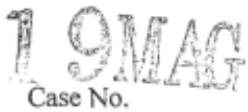
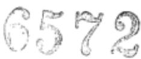
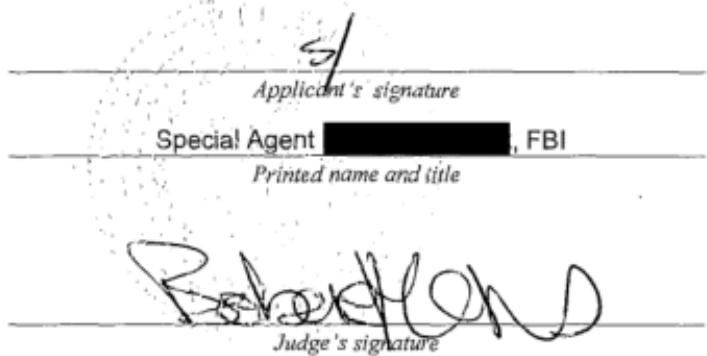
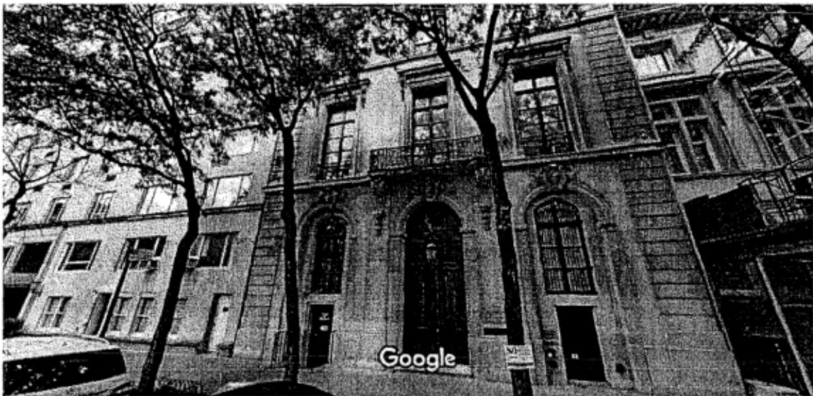
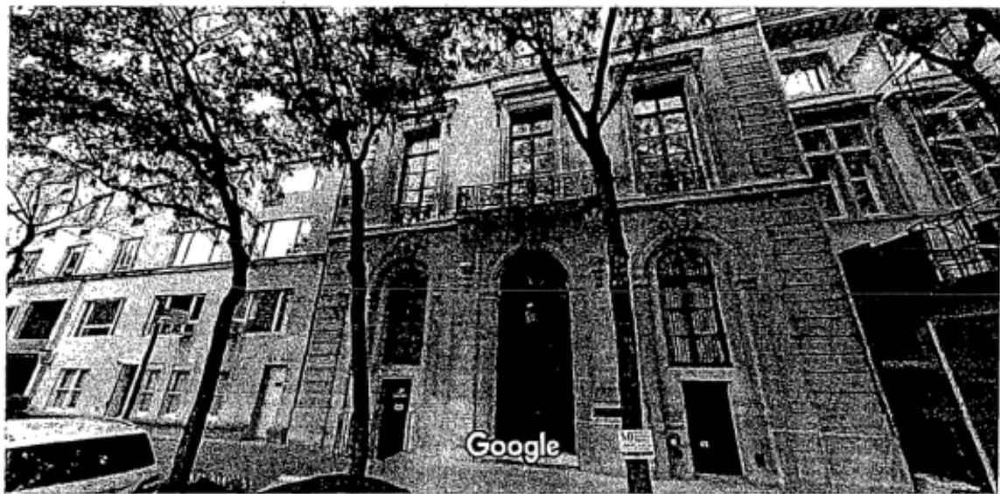

# UNITED STATES DISTRICT COURT

for the Southern District of New York

In the Matter of the Search of (Briefly describe the property to be searched or identify the person by name and address)

See Attached Affidavit and its Attachment A

## APPLICATION FOR A SEARCH AND SEIZURE WARRANT

I, a federal law enforcement officer or n aorey for the government, request a search warant and state under penalty of perjury that Ihavereasn to believe that on the following person orprperty identif te person or describe the property to be searched and give its location):

located in the Southerm District of New York , there is now concealed (identify the person or describe the property to be seized):

See Attached Afidavit and its Attachment A

The basis for the search under Fed. R. Crim. P. 41(c) is (check one or more):

vidence of a crime;

contraband, fruits of crime, or other items illgally possessed;

property designed for use, intended for use, or used in committing a crime;

a person to be arrested or a person who is unlawfully restrained.

The search is related to a violation of: Code Section(s) Offense Description(s)

## 18 U.S.C. SS 1591 and Sex trafficking of minors; sex trafficking conspiracy 371

The application is based on these facts:

See Attached Affidavit and its Attachment A

Continued on the attached sheet.

Delayed notice of days (give exact ending date if more than 30 days: ) is requested under 18 U.S.C. 8 3103a, the basis of which is set forth on the attached,sheet.

Sworn to before me and signed in my presence.

Date:7-4-19

City and state:New York, NY

Hon. Barbara Moses, U.S. Magistrate Judge

CONFIDENMALeele6 scetine

## UNITED STATES DISTRICT COURT SOUTHERN DISTRICT OF NEW YORK

In the Matter of the Application of the United States Of America for a Search and Seizure Warrant for the Premises Known and Described as 9 East 71st Street, New York, New York and Any Closed Containers/Items Contained Therein

TO BE FILED UNDER SEAL

Agent Affidavit in Support of Application for Search and Seizure Warrant

SOUTHERN DISTRICT OF NEW YORK) s.:

being duly sworn, deposes and says:

## I. Introduction

## A. Affiant

1. I have been a Special Agent with the Federal Bureau of Investigation ("FBI") since 2012. As such, I am a "federal law enforcement officer" within the meaning of Federal Rule of Criminal Procedure 41(a)(2)(C), that is, a government agent engaged in enforcing the criminal laws and duly authorized by the Attorney General to request a search warrant. I have been employed by the FBI for three and a half years, and I am currently assigned to investigate violations of criminal law relating to the sexual exploitation of children. I have gained expertise in this area through classroom training and daily work related to these types of investigations. As part of my responsibilities, I have been involved in the investigation of sex trafficking cases, and have been involved in search warrants for physical premises.

2. I make this Affidavit in support of an application pursuant to Rule 41 of the Federal Rules of Criminal Procedure for a second warrant to search the premises specified below (the "Subject Premises") for the purpose of seizing the items and information described in Attachment A. This affidavit is based upon my personal knowledge; my review of documents and other evidence; and my conversations with other law enforcement personnel. Because this affidavit is being submited for the limited purpose of establishing probable cause, it does not include al the facts that I have learned during the course of my investigation. Where the contents of documents and the actions, statements, and conversations of others are reported herein, they are reported in substance and in part, except where otherwise indicated.

## B. The Subject Premises

3. The Subject Premises are particularly described as a multi-story, single-family residence located at 9 East 71st Street, New York, New York, and include all locked and closed containers found therein. As detailed further herein, the Subject Premises is believed to be owned, possessed and controlled by JEFFREY EPSTEIN, a target subject of this investigation. A photograph of the front entrance to the Subject Premises is included below:

## C. The Target Subject and the Subject Offenses

4. The Target Subject of this investigation is JEFFREY EPSTEIN.

5. For the reasons detailed below, I believe that there is probable cause to believe that the Subject Premises contain evidence, fruits, and instrumentalities of violations of Title 18, United

States Code, Section 1591 (sex trafficking of minors); and Title 18, United States Code, Section 371 (sex trafficking conspiracy) (the "Subject Offenses") by the Target Subject.

## II. Probable Cause and the First Warrant

A. Probable Cause Regarding the Target Subject's Commission of the Subject Offenses

6. On or about July 2, 2019, a grand jury in this District returned an Indictment charging JEFFREY EPSTEIN with the Subject Offenses. A copy of the Indictment is attached hereto as Exhibit A and is incorporated by reference.

## B. Probable Cause Justifying Search of the Subject Premises

The Indictment and Victim-1

7. As set forth in Exhibit A, from at least in or about 2002, up to and including at least in or about 2005, JEFFREY EPSTEIN sexually abused multiple minor girls in the Southern District of New York and elsewhere. During that time and continuing to the present, EPSTEIN possessed and controlled the Subject Premises, which is described in Exhibit A as "the New York Residence."

8. As further set forth in paragraphs 8 through 10 of Exhibit A, from at least in or about 2002, up to and including at least in or about 2005, EPSTEIN sexually abused numerous minor victims at the Subject Premises. In particular, and as alleged in the Indictment, when a victim arrived at the Subject Premises, she would be escorted to a room inside the Subject Premises with a massage table, where she would perform a massage on EPSTEIN.

Following each encounter, EPSTEIN

or one of his employees or associates paid the victim in cash.

9. As set forth in paragraphs 12 through 13 of Exhibit A, to further facilitate his ability to abuse minor girls in New York, JEFFREY EPSTEIN asked and enticed certain of his victims to recruit additional minor girls to perform "massages" and similarly engage in sex acts with EPSTEIN. When a victim would recruit another minor girl for EPSTEIN, he paid both the victimrecruiter and the new victim hundreds of dollars in cash. EPSTEIN knew that his victims were underage, including because certain victims told him their age.

10. One of the victims identified in paragraph 22 of Exhibit A is Victim-1. As part of the FBI's investigation of EPSTEIN, other law enforcement officers have interviewed Victim-1.1 I know from my conversations with other law enforcement officers who have interviewed Victim-1, that Victim-1 has provided the following information, in substance and in part:

a. Between approximately 2002 and 2005, EPSTEIN sexually abused Victim-1 on multiple occasions in the Subject Premises. This sexual abuse all occurred when Victim-1 was under the age of 18.

b. During that same period, Victim-1 observed multiple floors of the Subject Premises and numerous individual rooms within the Subject Premises. Victim-1 has provided detailed descriptions of certain aspects of the interior of the Subject Premises, including Victim-1's memory of specific details regarding the layout, furnishings, decorations, and floor pattern of various areas within the Subject Premises.

c. In particular, Victim-1 observed that a bathroom in the residence contained what appeared to be a bust of a human torso (the "Torso"). Victim-1 believed that the Torso was possibly a type of sex toy.

d. In addition, Victim-1 recalled observing what appeared to be a taxidermied dog in a living space in the Subject Premises.

e. Victim-1 recalled that EPSTEIN typically abused her in a room she described as a "massage room," (the "Massage Room"), which contained a massage table, and was decorated with artwork depicting naked women, hung on walls that appeared to be adorned with fabric.

f. Victim-1 has not been in the Subject Premises since approximately 2005.

The July 6. 2019 Search Warrant of the Subject Premises

11. On or about July 6, 2019, the Honorable Barbara Moses, United States Magistrate Judge, signed a search warrant authorizing a search of the Subject Premises. The search warrant is attached as Exhibit B and incorporated by reference herein.

12. At approximately 6 p.m. on or about July 6, 2019, law enforcement officers (the "Search Team") commenced executing the search warrant at the Subject Premises; I joined the Search Team thereafter. While inside the Subject Premises, I observed the following, among other things:

a. Inside a closet within the entryway to a bathroom in the Subject Premises, I observed what appear to be two busts of female human torsos, from their upper pelvis to the neck. In addition, inside the bathroom, I observed a third bust, which appears to depict a female body from the ribcage to the clavicle (collectively, (the "Busts"). The Busts do not appear to be designed for use as sex toys, and appear instead to be artwork. Nevertheless, based on my conversations with law enforcement officers who have interviewed Victim-1, I have learned that the Busts appear to be generally consistent with Victim-1's description of observing the Torso in EPSTEIN's bathroom in the Subject Premises. Accordingly, there is probable cause to believe that the Busts are corroborating evidence of Victim-1's description of the Subject Premises.

b. Inside the Subject Premises, I observed a room that, based on my conversations with law enforcement officers who have interviewed Victim-1, appears to be consistent with Victim-1's descriptions of the Massage Room. The room contained a table covered with a sheet, and appears to be a massage table. The walls appear to be covered in a type of felt-like tapestry fabric. I further observed two paintings and three photographs hanging on the walls of the Massage Room. The paintings and photographs depict nude females. One of the photographs appears to depict a nude girl. Based on my training and experience investigating crimes involving the sexual exploitation of children, the girl appears to be approximately 15 to 20 years old.

C. Inside the Subject Premises, inside a closet adjacent to a bathroom, I observed a shelf that appears to contain several black binders, with labels on the spine of each binder. In particular, one of the binders is marked with a series of labels, one of which reads: "PB Girls." Given that the Indictment charges EPSTEIN with participating in a conspiracy to engage in sex trafficking of minor girls in both Palm Beach, Florida and New York, I believe that "PB Girls" may refer to minor victims in Palm Beach, Florida.

d. Inside the Subject Premises, in what appears to be EPSTEIN's office, on or about the second floor of the Subject Premises, I observed what appears to be a taxidermied dog (the "Dog"). Based on my conversations with law enforcement officers who have interviewed

Victim-1, the Dog appears to be consistent with Victim-1's description of observing a taxidermied dog in the Subject Premises.

e. Inside the Subject Premises, I observed in plain view several sheets of stationary, with letterhead marked "Jeffrey Epstein."

13. After observing the foregoing items, the Search Team stopped the search and froze the scene in order to seek a new search warrant.

## III. Conclusion and Ancillary Provisions

14. Based on the foregoing, given that several items described by Victim-1 as being present in the Subject Premises in 2005 appear to be currently in the Subject Premises, I respectfully submit there is probable cause to believe that evidence of the Subject Offenses, and in particular the items described in Attachment A, will be located within the Subject Premises and therefore request the court to issue a warrant to seize the items and information specified in Attachment A to this affidavit and to the Search and Seizure Warrant.

15. The Search Team is currently at the Subject Premises, securing the location, and would anticipate executing the requested search warrant immediately. However, given the late hour, it is anticipated that the Search Team would commence executing the search warrant after

10 p.m. In view of the foregoing circumstances, I respectfully submit that the present circumstances demonstrate good cause to execute the warrant after 10 p.m.

Leslie Adamczyk

Special Agent

Federal Bureau of Investigation

Sworn to before me on

July 6, 2019

THE HONORABLE BANBARA MOSES

UNITED STATES MAGISTRATE JUDGE

iar (Facetine)

## EXHIBIT A

# COUNT ONE (Sex Trafficking Conspiracy)

The Grand Jury charges:

## OVERVIEW

1. As set forth herein, over the course of many years, JEFrREy EPsTEIN, the defendant, sexuaLlyexploited and. abused dozens of minor girls at his homes in Manhattan, New York, and Palm Beach, Florida, among other locations.

2. In particulax, from at least in or about 2oo2, up to and including at Least in or about 2005, JEFFREY EPsTEIN, the defendant, enticed and recruited, and caused to be enticed and recruited, minor girls to visit his mansion in Manhattan, New Yoxk (the "New York Residence") and his estate in Palm Beachy Florida (the "Palm Beach Residence") to engage in sex acts with him, after which he would give the victims hundreds of dollars in cash. Moreover, and in order to maintain and increase his supply of victims, EpsTEIN also paid certain of his victims to recruit additional girls to be similarly abused by EpsTEin. In

SDNY\_GM\_00000116

this wayr EpsTEIN created a vast network of undexage victims for him to sexually exploit in. locations including New York and Palm Beach.

3. The viotims described hexein were as young as 14 years old at the time they were abused by JEFEREY EPsTEIN, the defendant, and were, for various reasons, often particularly vulnerable to exploitation. EpsTEIN intentionally sought out minors anc knew that many of his victims were in fact under the age of la, including because, in some instances, minor victims expressly told him their age.

4. In creating and maintaining this network of minor victims in muItiple states to sexually abuse and exploit, JEFEREY EPsTEIN, the defendant, worked and conspired with others, including employees and associates who facilitated his conduct by, among other things, contacting victims and scheduling their sexual encounters with EPsTEIN at the New York Residence and at the Palm Beach Residence.

## FACTUAL BACKGROUND

5. During all time periods charged in this Indictment, JEEFREY EPsTEIN, the defendant, was a financier with multiple residences in the continental United states, including the New York Residence and the Palm Beach Residence.

6. Beginning 1n at least 2002, JEFFREY EPsTEIN, the defendant, enticed and recruited, and caused to be enticed and recruited, dozens of minor girls to engage in sex acts with him,

after which EpsTeIN paid the viotims hundreds of dollars in

cash, at the New York Residence and the Palm Beach Residence.

7： In both New York and Florida, JEFFREY EPSTEIN,

the defendant, perpetuated this abuse in similar ways. victims

were initlaIly recruited to provide "massages" to EpsreiN, which

would be performed nude or partially nude, would become

incxeasingly sexual in nature, and would typically include one

or more sex acts. EpsrEiN paid his victims hundreds of dollars

in cash for each encounter. Moreover, EPsrEIN actively

encouraged certain of his victims to recruit additional gixls to

be similarly sexually abused. EpsreiN incentivized his victims

to become recruiters by paying these victim-recruiters hundreds

of dollars for each girl that they brought to EPsrEIn. In so

doingr Eesrein maintained a steady supply of new victims to

exploit.

## The New York Residence

8， At all times relevant to this Indictment, JEFEREy

EPsrEIN, the defendant, possessed and controlled a multi-story

private residence on the Upper East side of Manhattan, New York,

i.e., the New York Residence. Between at least in or about 2002

and dn or about 2005, EPsTEIN abused numexous minor victims at

the New York Residence by causing these victims to be recruited

to engage in paid sex acts with him.

9. when a victim arrived at the New York Residence, she typically would be escorted to a room with a massage table, where she would perfoxm a massage on JErFREY EPsTEIN, the defendant. The victims, who were as young as 14 years of ager were told by EpsrEiN or other individuals to partially or fully undress before beginning the "massage." During the encounter, EPsTEIN would escalate the nature and scope of

I. EpsTEIN typically would also

10. In connection with each sexual encounter, JEFFREY EPsTEIN, the defendant, or one of his employees or associates, paid the victim in cash. victims typically were paid hundreds of dollars in cash for each encounter.

11. JEFFREY EPsTEIN, the defendant, knew that many of his New York victims were underage, including because certain victims told him their age. Further, once these minor victims were recruited, many were abused by EPsTErn on multiple subsequent occasions' at the New York Residence. EPsTEIn sometimes personally contacted victims to schedule appointments at the New York Residence. In other instances, EPSTEIN directed employees and associates, including a New York-based employee

("Employee-1"), to communicate with victims via phone to arrange

for these victims to return to the New Yoxk Residence for

additional sexual encounters with EPsTETN.

12. Additionally, and to further facilitate his

ability to abuse minor girls in New York, JEFFREy EPsTEIN, the

defendant, asked and enticed certain of his victims to recruit

additional girls to perform "massages" and similarly engage in

sex acts with EpsrEin. when a viotim would recruit another girl

for EPsTEIn, he paid both the victim-recruiter and the new

victim hundreds of dollars in cash. Through these victim-

recrulters, EpsrEIN gained access to and was able to abuse

dozens of additional minor giris.

13. In particular, certain recruiters brought dozens

of additional minor girls to the New York Residence to give

massages to and engage in sex acts with JEreREy EPsTEIN, the

defendant. EpsTEIN encouraged victims to recruit additional

girls by offering to pay these victim-recruiters for every

additional girl they bxought to EpsrEIN. When a victim-

recruiter accompanied a new minor victim to the New York

Residence, both the victim-recruiter and the new minor victim

were paid hundreds of dollars by EpsrEiN for each encounter. In

addition, certain victim-recruiters routinely scheduled these

encounters through Employee-1, who sometimes asked the

recruiters to bring a specific minor girl for EpsTEIN.

## The Palm Beach Residence

14. In addition to recruiting and abusing minor girls.

in New York, JErEREY EPsTEIN, the defendant, created a similar

network of minor girls to victimize in Palm Beach, Florida,

where EpsrEiN owmed, possessed and controlled another large

residence, i.e.r the Palm Beach Residence. EPsrEIN Erequently

traveled from New York to Palm Beach by private jet, before

which an employee or associate wouId ensure that minor victims

were available for encounters upon his arrival in Florida.

15. At the Palm Beach Residence, JEFFREY EPsTEIN, the

defendant, engaged in a similar course of abusive conduct.

When a victim initially arxived at the Paim Beach Residence, she

would be escorted to a room, sometimes by an employee of

EPsTEIn's, including, at times, two assistants ("Employee-2" and

"Employee-3") who, as described herein, were also responsible

for scheduling sexual encounters with minor victims. Once

inside, the victim wouid provide a nude or semi-nude massage for

EPsTEIN, who would himself typically be naked.

16. In connection with each sexual encounter, JErEREy EPsTEIN, the defendant, or one of his employees or associates, paid the victim in cash. victims typically were paid hundreds of dollars for each encounter.

17. JEFFREY EPsTEIN, the defendant, knew that certain of his victims were underage, including because certain victims told him their age. In addition, as with New York-based victims, many Florida victimsy once recruited, were abused by JEFFREY EPsTEIN, the defendant, on multiple additional occasions.

18. JEFFREY EPSTEIN, the defendant, who during the relevant time period was frequently in New York, would arrange for Employee-2 or other employees to contact victims by phone in advance of EPsTEIN's travel to Florida to ensure appointments were scheduled For when he arrived. In particular, in certain instances, Employee-2 placed phone calls to minor victims in Florida to schedule encounters at the Palm Beach Residence. At the time of cextain of those phone calls, EPsTEIN and Employee-2 were in New York, New York. Additionally, certain of the individuals victimized at the Palm Beach Residence were contacted by phone by Employee-3 to schedule these encounters.

19. Moreover, as in New York, to ensure a steady stream of minor victims, JEFFREY EPsTEIN, the defendant, asked and enticed certain victims in Florida to recruit other girls to engage in sex acts. EpsrEiN paid hundreds of dollars to victim-- recruiters for each additional gixl they brought to the Palm Beach Residence.

## STATUTORY ALLEGATIONS

20. From at least in or about 2002, up to and including in or about 20o5, in the Southern District of New York and elsewhere, JEFEREY EPSTEIN, the defendant, and others known and unknown, willfully and knowingiy did combine, conspire, confederate, and agree together and with each other to commit an offense against the United states, to wit, sex trafficking of minors, in violation of Title l8, United States Code, Section. 1591(a) and (b).

21. It was a part and object of the conspiracy that JEFEREY EPsTEIN, the defendant, and others known and unknown, would and did, in and affecting interstate and foreign commerce, recruit, entice, harbor, transport, provide, and obtain, by any means a person, and to benefit, financially and by receiving anything of value, from participation in a venture which has engaged in any such act, knowing that the person had not attained the age of 18 years and would be caused to engage in a commercial sex act, in violation of Title l8, United States Code, Sections I591(a) and (b)(2).

## Overt Acts

22. In furtherance of the conspiracy and to effect the illegal object thereof, the following overt acts, among others, were committed in the Southern District of New York and elsewhere:

a. In or about 2004, JEFEREY EPSTEIN, the defendant, enticed and recruited multiple minor victims, including minor victims identified herein as Minor vi.ctim-l, Minor Victim-2r and Minor victim-3, to engage in sex acts with EPsTEIN at his residences in Manhattan, New York, and Palm Beach, Florida, after which he provided them with hundreds of dollars in cash for each encounter.

b. In or about 2002, Minor victim-1 was recruited to engage in sex acts with Epsrein and was repeatedly sexually abused by EPsTEIN at the New York Residence over a period of years and was paid hundreds of dollars for each encounter. EPsTEIN also encouraged and enticed Minor victim-l to recruit other girls to engage in paid sex acts, which she did. EpsTEIN asked, Minor Victim-1 how old she was, and Minor victim-1 answered truthfully.

c. In or about 2004, Employee-1, located in the Southexn District of New York, and on behalf of EPsTEIN, placed a telephone call to Minor victim-1.in order to schedule an appointment for Minor victim-1 to engage in paid sex acts with EPSTEIN.

d. In or about 2004, Minor victim-2 was recruited to engage in sex acts with Epsrein and was repeatedly sexually abused by EpsrEin at the Palm Beach Residence over a period of years and was paid hundreds of dollars after each encounter. EpsrEIn also encouraged and enticed Minor yictim-2 to recruit other girls to engage in paid sex acts, which she / did.

e. In or about 2005, Employee-2, Located in the Southexn District of New York, and on behalf of EPsTEIN, placed a telephone call to Minor Victim-2 in order to schedule an appointment for Minor victim-2 to engage in paid sex acts with EPSTEIN.

f.In or about 2005, Minor Victim-3 was recruited to engage in sex acts with EpsrEin and was repeatedly sexually abused by EPsTEIN at the Palm Beach Residence over a period of years and was paid hundxeds of dollars for each encounter. EPsTEiN also encouraged and enticed Minor victim-3 to recruit other girls to engage in paid sex acts, which she did. EPsTEIN asked Minor Victim-3 how old she was, and.Minor victim-3 answered truthfully.

g. In or about 2005, Employee-2, Located in the

Southern District of New York, and on behalf of EpsTEIN, placed

a telephone call to Minor Victim-3 in Florida in order to

schedule an appointment for Minor victim-3 to engage in paid sex

acts with EPSTEIN.

h. In or about 2004, Employee-3 placed a

telephone call to Minor victim-3 in order to schedule an

appointment for Minor victim-3 to engage in paid sex acts with'

EPSTEIN.

(Title 18, United States Code, Section 371.)

# COUNT TWO (Sex Trafficking)

The Grand Jury further charges:

23. The allegations contained in paragraphs'1

through 19 and 22 of this Indictment are repeated and reaileged

as if fully set forth within.

24. From at least in or about 2002, up to.and

including in ox about 20o5, in the southern District of New

York, JEFrREY EPsrEIN, the'defendant, willfully and knowingly,

in and affecting interstate and foreign commerce, did recruit,

entice, harbor, transport, provide, and obtain by any means a

person, knowing that the person had not attained the age of 18

years and would be caused to engage in a commercial sex acty and

did aid and abet the same, to wit, Epsrein recruited, enticed,

harbored, transported, provided, and obtained numerous.

SDNY\_GM\_00000126

individuals who were less than l8 years old, including but not limited to Minox victim-l, as described above, and who were then caused to engage in at least one commercial sex act in Manhattan, New York.

(Title 18, United. states Code, Sections 1591(a), (b)(2), and 2.)

## FORFEITURE ALLEGATIONS

25. As a result of committing the offense alleged in Count Two of this Indictment, JErEREY EPSTEIN, the defendant, shall forfeit to the United states, pursuant to Title 18, United States Code, Section 1594(c)(1), any property, real and personal, that was used or intended to be used to commit or to facilitate the commission of the offense alleged in Count Twor and any property, real. or personal, constituting or derived from any proceeds obtained, directly or indirectly, as a result of the offense alleged in Count Two, or any property traceable to such property, and the following specific property:

a. The Lot or parcel of land, together with its buildings, appurtenances, improvements, fixtures, attachments and easements, located at 9 East 7lst Street, New York, New York, with block number 1386 and 1ot number 10, owned by Maple, Inc.

## Substitute Asset Provision

26. If any of the above-deseribed forfeitable

property, as a result of any act or ornission of the defendant:

(a) cannot be located upon the exercise of due diligence;

(b) has been transferred or sold to, or deposited with, a third personi

(c) has been placed beyond the jurisdiction of the Court,

(d), has been substantially diminished in value; or

(e) has been commingled with other property which cannot be subdivided without difficulty;

it is the intent of the United states, pursuant to 21 U.S.C.

(ritle 18, United states Code, SectLon 1594;Title 21, United states Code, Section B53(p)i and Title 28, United states Code, Section 2461.)

ttmh atFOREPERSON

GEOFFREY S. BERMAN

United states Attoxney

Form No. USA-33s-274 (Ed. 9-25-58)

UNITED STATES DISTRICT COURT SOUTHERN DISTRICT OF NEW YORK

UNITED STATES OF AMERICA

v.

JEFFREY EPSTEIN,

Defendant.

## INDICTMENT

(18 0.s.C. ss 371, 1591(a), (b)(2), and2)

GEOFEREY S. BERMAN United states Attorney

Foreperson

EXHIBIT B

# UNITED STATES DISTRICT COURT

for the Southern District of New York

In the Matter of the Search of (Briefly describe the property to be searched or identfy the person by name and address)

See Attachment A

19MAG

Case No.

6572

## SEARCH AND SEIZURE WARRANT

To: Any authorized law enforcement officer

An application by a federal law enforcement officer or an attomey for the government requests the search of the following person or property located in the Southern District of New York (identify the person or describe the property to be searched and give is location):

## See Attachment A

Thepesr iis eee ai  ee fo be setzed):.

See Attachment A

The search and seizure are related to violation(s) of (asert stattory ciations):

## Title 18, United States Code, Sections 371 and 1591

I find that the afidavits), or any recorded testimony, establish probable cause to search and seize the person or property.

YOU ARE COMiMANDED to execute this warrant on or before 7.20.19

(not to exceed 14 days)

in the daytime 6:00 a.m. to 10 p.m. at any time in the day or night as I find reasonable cause has been established.

Unless delayed notice is authorized below, you must give a cop of the warrant and a receiptfor theproperty taken to the person from whom, or from whose premises the property was taken, or leave the copy and receipt at the place where the property was taken.

The officer executing this warrant, or an offi cer present during the execution of the warrant, must prepare an inventory as required by law and promptly return this warrant and inventory to the Clerk of the Court.

Upon its return, this warrant and inventory should be filed under seal by the Clerk of the Court.

USMJ bnillals

I findthat immediate notification may have an adverse resul isted in 18U.S.C2705 (except for delay of trial), and authorize the oficer executing this warrant to delay notice to the person wh, or whose propert, wii be searched or seized (check the appropriate box)for day (not to exceed 30).

until, the facts justifying, thelater specific date of

Date and timeisued:1.6.1910.14a.M. Judge's signdture

City and state:New York, NY

Hon. Barbara Moses, U.S. Magistrate Judge

A0 93 (SDNY Rev. 01/17) Search and Selzure Warant (Page 2)
<table><tr><td colspan="3">Return</td></tr><tr><td>Case No.:</td><td>Date and time warrant executed:</td><td>Copy of warrant and inventory left with:</td></tr><tr><td colspan="3">Inventory made in the presence of : Inventory of the property takcen and name of any person(s) seized:</td></tr><tr><td></td><td></td></tr><tr><td colspan="3">Certification</td></tr><tr><td colspan="3">I declare under penalty of perjury that this inventory is corect and was returned along with the original warrant to the Court.</td></tr><tr><td colspan="3">Date: Execarting officer&#x27;s signature Printed name and title</td></tr></table>

# ATTACHMENTA

## I. Premises to be Searched—Subject Premises

1. The premises to be searched (the "Subject Premises") are described as a nearly 19,000 square foot multi-story single-family residence located at 9 East 71st Street, New York, New York, and include all locked and closed containers found therein. A photograph of the firont entranice to the Subject Premises is included below:

## II. Items to Be Seized

1. This warrant authorizes executing agents to photograph, video record and otherwise document the full interior of the Subject Premises, including any items, furnishings, or possessions therein.

2. In addition, this warrant authorizes the seizure of certain evidence, fruits, and instrumentalities of violations of Title 18, United States Code, Sections 1591 (sex trafficking of minors) and 371 (sex trafficking conspiracy) (the "Subject Offenses") described as follows:

a. Evidence·concerning occupancy or ownership of the Subject Premises, including utility and telephone bills, mail envelopes, addressed correspondence, diaries, statements, identification documents, address books, telephone directories, and photographs of its occupant(s).

b. Evidence concerning the layout, furnishings, decorations, and floor pattern of the Subject Premises, including photographs and blueprints of the Subject Premises.