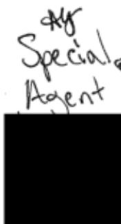
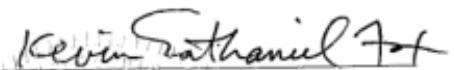
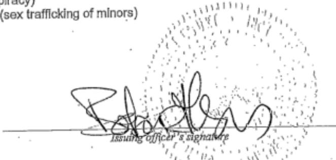
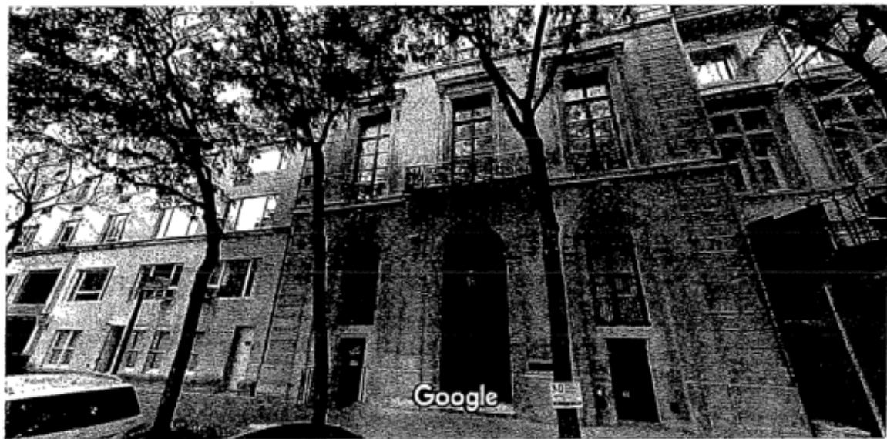
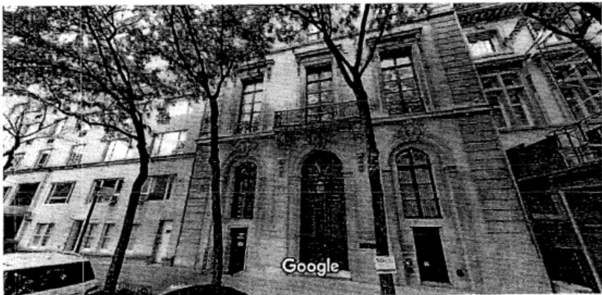
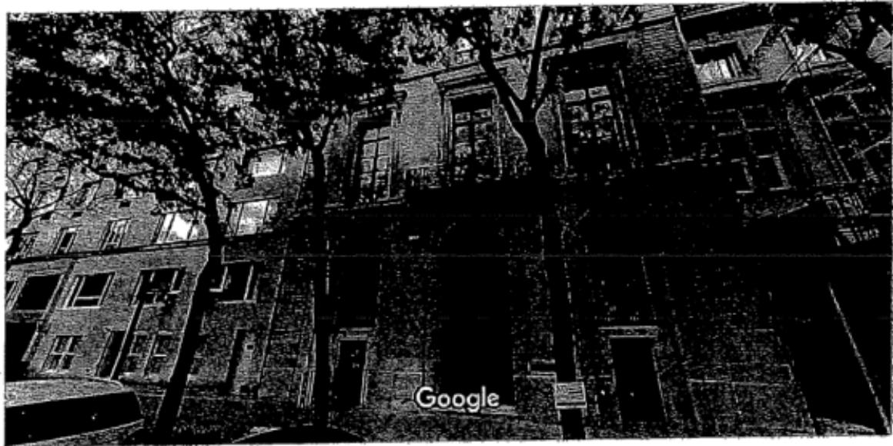

# UNITED STATES DISTRICT COURT

for the

19MAG Case No.

6581

I,a federal menoffcrao f ho, eewara a state efefe property to be searched and give its location):

located in the SouthrnDistic of New York , there is now concealed dent te person or describe the property to be seized):

See Attached Affidavit and its Attachment A

The basis for thesearch under Fed.R.Crim.P.41(c) i (checkoe or mre):

evidence of a crime;

contraband, fuits of crime, or other items illegally possessed

ppertesigned for use, intended for seoruse incoiting a crie

a person to be arrested or a person who is unlawfully restrained.

The search is related to a violation of:

Codes scg1591+371

Offense Description(s) Sex Trafficlcing of Minors sex Trafficking Conspiracy

The application is based on these facts:

See Attached Affidavit and ts Attachment A

Continued on the attached sheet.

Delayed notice of30days(give exact ending date if more than 30 days ) is requested under 18 U.S.C. s 3103a, the basis of which is set forth on the attached sheet

'Sworn to before me and signed in my presence.

Date: JUL152019

City and state: New York, NY

HON. KEVIN NATHANIEL FOX

## UNITED STATES DISTRICT COURT SOUTHERN DISTRICT OF NEW YORK

In the Matter of the Application of the United States Of America for a Search and Seizure Warrant for (1) a black iPhone with IMEI number 357201093322785, (2) a silver iPad with serial number DLXQGM3KGMW3, (3) two black binders with CDs, (4) two black hard drives, (5) a box of CDs, and (6) two binders with various CDs

TO BE FILED UNDER SEAL

Agent Affidavit in Support of Application for Seareh and Seizure Warrant

SOUTHERN DISTRICT OF NEW YORK) ss.:

|being duly sworn, deposes and says:

## I. Introduction

## A. Affiant

1. I have been a Special Agent with the Federal Bureau of Investigation ("FBI") since As such, I am a "federal law enforcement officer" within the meaning of Federal Rule of Criminal Procedure 41(a)(2)(C), that is, a government agent engaged in enforcing the criminal laws and duly authorized by the Attormey General to request a search warrant. I am currently assigned to investigate violations of criminal law relating to the sexual exploitation of children. As part of my responsibilities, I have participated in numerous investigations and prosecutions of crimes against children, including the sex trafficking of minors, and have participated in the execution of search warrants involving electronic evidence.

2. I make this Affidavit in support of an application pursuant to Rule 41 of the Federal Rules of Criminal Procedure for a warrant to search certain electronic devices, compact disks and related electronic media specified below (the "Subject Items") for the items and information described in Attachment A. This affidavit is based upon my personal knowledge; my review of documents and other evidence; my conversations with other law enforcement personnel; and my training, experience and advice received concerning the use of computers in criminal activity and the forensic analysis of electronically stored information ("'ESI"). Because this affidavit is being submitted for the limited purpose of establishing probable cause, it does not include all the facts that I have learned during the course of my investigation. Where the contents of documents and the actions, statements, and conversations of others are reported herein, they are reported in substance and in part, except where otherwise indicated.

## B. The Subject Items

3. The Subject Items are particularly described as follows1:

a. A black iPhone with IMEI number 357201093322785, which was seized .from JEFFREY EPSTEIN on or about July 6, 2019 ("Subject Item-1").

b. A silver iPad with serial number DLXQGM3KGMW3, which was seized from JEFFREY EPSTEIN on or about July 6, 2019 ("Subject Item-2").

C. Two black binders with CDs, which were seized from a blue suitcase on or A about July 11, 2019 ("Subject Item-3"). by Specia aent

d. Two black hard drives, which were seizedfrom a blue suitcase on or about July 11, 2019 ("Subject Item-4”). by Special Agent

e. A box of CDs, which was seized from a blue suitcase on or about July 11, 2019 ("Subject Item-5"). by pecial Agent

f. Tobiner witarushchereia uit or about July 11, 2019 ("Subject Item-6"). y Specia Aget

4. Based on my training, experience, and research, I know that Subject Item-1 and Subject Item-2 both have capabilities that allow them to serve as a wireless telephone, digital camera, portable media player, GPS navigation device, and PDA.

5. The Subject Items are all presently located in the Southern District of New York.

## C. The Target Subject and the Subject Offenses

6. The Target Subject of this investigation is JEFFREY EPSTEIN.

7. For the reasons detailed below, I respectfully submit that there is probable cause to believe that the Subject Items contain evidence, fruits, and instrumentalities of violations of Title 18, United States Code, Section 1591 (sex trafficking of minors); and Title 18, United States Code, Section 371 (sex trafficking conspiracy) (the "Subject Offnses") by the Target Subject.

## II. Probable Cause

## A. Probable Cause Regarding the Target Subject's Commission of the Subject Offenses

8. On or about July 2, 2019, a grand jury in this District returned an Indictment charging JEFFREY EPSTEIN with the Subject Offenses. A copy of the Indictment is attached hereto as Exhibit A and is incorporated by reference.

9. That same day, the Honorable Barbara Moses, United States Magistrate Judge, signed an arrest warrant for JEFFREY EPSTEIN. A copy of the Arrest Warrant is attached hereto as Exhibit B and is incorporated by reference.

## B. Probable Cause Justifying Search of the Subject Items

The Indictment and Victim-1

10. As set forth in Exhibit A, from at least in or about 2002, up to and including at least in or about 2005, JEFFREY EPSTEIN sexually abused multiple minor girls in the Southern District of New York and elsewhere. During that time and continuing to the present, EPSTEIN possessed a ontolled a l-stor, siglefiy residence lcate t9 EaststSte, Ne York, New York, which is described in Exhibit A as "the New York Residence."

11. As further set forth in paragraphs 8 through 10 of Exhibit A, from at least in or about 2002, up to and including at least in or about 2005, EPSTEIN sexually abused numerous minor victims at the New York Residence. In particular, and as alleged in the Indictment, when a victim arrived at the New York Residence, she would be escorted to a room inside the Subject Premises with a massage table, where she would perform a massage on EPSTEIN. The victims, who were as young as 14 years of age, were told by EPSTEIN or other individuals to partially or fully undress before beginning the "massage." During the encounter, EPTEIN would escalate the nature and scope of physical contact with his victim to include, among other things, sex acts such as groping and direct and indirect contact with the victims' genitals. EPSTEIN typically would also masturbate during these sexualized encounters, ask victims to touch him while he masturbated, and touch victims' genitals with his hands or with sex toys. Following each encounter, EPSTEIN or one of his employees or associates paid the victim in cash.

12. As set forth in paragraphs 12 through 13 of Exhibit A, to further facilitate his ability to abuse minor girls in New York, JEFFREY EPSTEIN asked and enticed certain of his victims to recruit additional minor girls to perform "massages" and similarly engage in sex acts with EPSTEIN. When a victim would recruit another minor girl for EPSTEIN, he paid both the victimrecruiter and the new victim hundreds of dollars in cash. EPSTEIN knew that his victims were underage, including because certain victims tol him their age.

13.Oneof the victims identie in paragph of ExhibitA is Victi-1.A pa of the FBI's investigation of EPSTEIN, other law enforcement officers and I have interviewed

Victim-1.2 During those interviews, Victim-1 has provided the following information, in substance and in part:

a. Between approximately 2002 and 2005, EPSTEIN sexually abused Victim-1 on multiple occasions in the New York Residence. This sexual abuse all occurred when Victim-1 was under the age of 18.

The July 6, 2019 Seizure of Subject Item-1 and Subject Item-2

14. I know from my personal participation in this investigation and my conversations with other law enforcement agents that on July 6, 2019, JEFFREY EPSTEIN was aboard a private New Jersey. Upon his arrival at Teterboro Airport, and as part of his re-entry into the United States, EPSTEIN was searched by agents of U.S. Customs and Border Protection ("CBP"), who found both Subject Item-1 and Subject Item-2 in EPSTEIN's possession. The CBP agents then provided Subject Item-1 and Subject Item-2 to Special Agents of the FBI who also placed EPSTEIN under arrest. The FBI subsequently transported Subject Item-1 and Subject Item-2 to FBI offices located in the Southern District of New York, where they are currently located.

The July 6, 2019 and July 7, 2019 Search Warrants for the New York Residence

15. On or about July 6, 2019, the Honorable Barbara Moses, United States Magistrate Judge, signed a search warrant authorizing a search of the New York Residence. The search warrant is attached as Exhibit C and incorporated by reference herein.

16. At approximately 6 p.m. on or about July 6, 2019, law enforcement officers (the "Search Team") commenced executing the search warrant at the New York Residence.

17. Based on the Search Team's observations during an initial search of the New York Residence, at approximately 7 p.m., the Search Team stopped the search and froze the scene in order to seek a new search warrant.

18. On or about July 7, 2019, the Honorable Barbara Moses, United States Magistrate Judge, signed a second search warrant authorizing a search of the New York Residence (the "Second Warrant"). The Second Warrant is attached as Exhibit D, and incorporated by reference herein. At approximately 2:30 a.m., the Search Team resumed the search, and commenced searching pursuant to the Second Warrant.

19.Based on my conversations with members of the Search Team,I have learned the following:

a. The Search Team observed a number of computing devices, including computers and tablet devices, throughout the New York Residence.

b. Inside a safe in a closet on the third floor (the "Safe"), the Search Team discovered and seized, among other items, several binders containing sleeves of compact discs, most of which are labeled with handwriting. In total, the binders contain dozens of compact discs. One disc is labeled "Young- Another disc is labeled "Nudes 00-24." Another is labeled "Misc. Nudes." Yet another is labeled "Girl Pics Nude." Some discs contain the word "Zorro"or“LSJ." For example, one disc is marked "Dana Zorro Pics." Based on my conversations with law enforcement agents who have participated in this investigation, I believe the name "Zorro" refers to Zorro Ranch, EPSTEIN's property in New Mexico, and the name LSJ refers to Little Saint James, EPSTEIN's property in the U.S. Virgin Islands. The majority of the discs contain titles that include female names. Some of the discs in the binders seized by the Search Team have titles that appear to refer to trips or vacations.

c. During the search, the Search Team did not seize at that time certain binders of discs located in the Safe, where the majority of the discs in the binder were labeled in a manner that did not appear to refer to girls or nudes. The Search Team also did not seize at that time several unlabeled hard drives, which were also located in the Safe. As detailed below, those additional binders of discs are among the subjects of this application.

d. In addition to the Safe, in the drawer of a dresser in a room on the Fifth floor of the New York Residence, the Search team discovered and seized, among other items, a shoebox (the "Shoebox") which contained numerous compact discs. The majority of the discs are labeled, in handwriting, with female names. One disc is labeled "Thai Massage." Another disc is labeled "Blonde Girl Photo Shoot." Yet another disc is labeled "Misc. Girls Nude/Dinner--Scientists." The discs in the Shoebox were seized by the Search Team. In another drawer of that same dresser, the Search Team discovered loose polaroid photographs depicting young, nude females who, based on the training and experience of law enforcement officers who observed them, appear to be teenagers. In that same drawer, the Search Team discovered a folder marked, in handwriting, which contained photographs, including nude and sexually suggestive photographs of a young girl who, based on the training and experience of law enforcement officers who observed them, appears to be younger than 18. The folder also contained other nude photographs of young

girls who appear to be teenagers, based on my training and experience. Inside the folder is a compact disc marked which was seized by the Search Team.

e. In a closet on the Fifth Floor of the New York Residence, the Search Team discovered, among other items, a box marked "women/old photos." The box contained, among other items, approximately seven compact discs, which are labeled with hand-written titles. One disc is labeled "nudes 00-24." Another is labeled "Photographer-Mackla \*03" The remaining discs contain titles that include female names. All of the foregoing discs were seized by the Search Team.

f. In that same closet, the Search Team discovered numerous black binders containing what appear to be print outs of digital photographs (with file names underneath) and compact discs. The Search Team seized approximately ten binders (the "Seized Binders") 3 which appeared to contain, among other photographs, photographs of nude or partially nude young girls, some of which are in sexually suggestive poses. Based on the training and experience of law enforcement officers who observed them, at least some of the young girls depicted in the photographs appear to be teenagers, including some who appear to be under the age of 18. The Seized Binders also include photographs of what appear to be personal functions, events, and travel.

g. The compact discs seized by the Search Team and described in paragraphs (a)-(d) are currently stored within the Southern District of New York in containers marked for identification with FBI evidence numbers 15, 16, 17, 18, and 22 (the "Seized Discs'").

The July 7. 2019 Search Warrant for the Seized Discs

20. On or about July 7, 2019, the Honorable Barbara Moses, United States Magistrate Judge, signed a third search warrant to search and seize electronic media stored on the Seized Discs (the "Third Search Warrant"). The Third Warrant is attached as Exhibit E, and incorporated by reference herein.

21. Based on my conversations with law enforcement agents who have reviewed the Seized Discs pursuant to the Third Search Warrant (the "Reviewing Agents"), I have learned the following:

a. The discs contain approximately thousands of nude or partially nude photographs of girls or young women, many of which are in sexually suggestive poses. Based on my conversations with the Reviewing Agents, who have particular training and experience relating to child erotica and visual depictions of children in child exploitation cases, I have learned that the Reviewing Agents believe that many of the nude or partially nude images they have reviewed appear to depict girls under the age of 18. Moreover, many of the photographs appear to be labeled with file names that suggest the photographs depict these girls at properties associated with JEFFREY EPSTEIN. For example, some file names are labeled "Zorro" or "LSJ."

b. Among the photographs on the Seized Discs, the Reviewing Agents identified partially-nude photographs of a young girl, labeled with an associated name that matched a particular individual ("Individual-1"). After identifying those photographs, the Government was advised by Individual-1's counsel that Individual-1 recalls the month and year during which she believes those partially-nude photographs were taken, and also the location where they were taken, and that she was 17 years old at the time.

The July 11, 2019 Search Warrant for All Electronic Devices and Storage Media in the New York Residence

22. Following the initiation of the FBI's review of the Seized Discs, on or about July 11, 2019, the Honorable Henry B. Pitman, United States Magistrate Judge, signed another search warrant authorizing another search of the New York Residence and specifically authorizing the seizure and search of electronic devices and storage media inside the New York Residence (the "Fourth Warrant"). The Fourth Warrant is attached as Exhibit F and incorporated by reference herein.

23. Later on July 11, 2019, the Search Team executed the Fourth Warrant at the New York Residence.

24. Based on my conversations with members of the Search Team, I have learned the following, among other things, regarding the execution of the Fourth Warrant:

a. During the July 11, 2019 execution of the Fourth Warrant inside the New York Residence, the Search Team found that the Safe described above was empty and, in particular, that the collection of discs and hard drives described in paragraph 19b, above, that the Search Team had not seized during its prior search of the New York Residence on July 7, 2019, had been removed.

b. After discovering that the Safe was empty, the Search Team spoke with an employee who worked at the New York Residence (the "Employee"). During that conversation, the Employee told the Search Team that after the completion of the prior search on July 7, 2019, the Employee had been instructed by a third party ("the Third Party") to take the contents of the Safe out of the New York Residence and deliver those items to the Third Party. The Employee further told the Search Team that after receiving that instruction, the Employee packed the contents of the Safe into two suitcases and delivered those suitcases to the Third Party. The Employee provided the Search Team with the Third Party's contact information.

C. The Search Team then contacted the Third Party. During the ensuing conversation, the Third Party confirmed receipt of two suitcases from the Employee but also told the Search Team that the Third Party had not opened the suitcases or touched or tampered with their contents. The Third Party also agreed to deliver the two suitcases to the Search Team.

d. Later on July 11, 2019, and consistent with the conversation described above, the Third Party met the Search Team outside of the New York Residence and provided them with the two suitcases described above, one of which was blue and one of which was black. Consistent with standard law enforcement protocol, the Search.Team conducted an inventory of both suitcases before taking custody of them. While taking an inventory of the blue suitcase, the Search Team discovered, among other items, Subject Item-3, Subject Item-4, and Subject Item-5. While taking an inventory of the black suitcase, the Search Team discovered, among other items, Subject Item-6. These items, i.e., Subject Items -3, -4, -5, and -6, appeared to be the same items observed in the Safe by the Search Team during the July 7, 2019 search of the New York Residence.

## The 2018 Payments

25.Based on my participation in this investigation, my review of open source materils, and my review of financial records, I have further learned the following:

a. On or about November 28, 2018, the Miami Herald began publishing a series of articles related to JEFFREY EPSTEIN, his sex trafficking of minor girls, and the circumstances of a non-prosecution agreement ("NPA") he previously negotiated with the Southern District of Florida. Among other things, the NPA identified several individuals as EPSTEIN's co-conspirators in the sex trafficking of minor girls.

b. Records obtained by the Government from a financial institution ("Institution-1") appear to show that just two days after the Miami Herald began publishing its series, on or about November 30, 2018, the defendant wired \$100,000 from a trust account he controlled to an individual named as a possible co-conspirator in the NPA. The same records from Institution-1 appear to show that just three days after that, on or about December 3, 2018, the defendant wired \$250,000 from the same trust account to another individual named as a possible co-conspirator in the NPA and also identified as one of the defendant's employees in the Indictment. Neither of these payments appears to be recurring or repeating during the approximately five years of bank records presently available.

C. This course of action, and in particular its timing, suggests the defendant was stil in communication with and attempting to further influence co-conspirators who might provide information against him in light of the recently re-emerging allegations.

## Request to Search the Subject Items

26. Based on my training and experience and participation in this investigation, I respectfully submit that there is probable cause to believe that the Subject Items will contain and/r constitute additional fruits, evidence and instrumentalities of the Subject Offenses. As an initial matter, all of the Subject Items were initially found in the same Safe in which EPSTEIN was storing discs and other media already reviewed and which contain hundreds of not thousands of nude and suggestive images of young females, some of whom appear to be under 18. Given as much, and because there is probable cause to believe that Epstein engaged in sex trafficking of underage girls, there is probable cause to believe that the additional storage media in EPS'TEIN's possession and control——i.e., the Subject Items——will contain evidence of the Subject Offenses. Moreover, that efforts were made to remove Subject Items -3, -4, -5, and -6 from the New York Residence after the initial search only further reinforces the probable cause to believe that those Subject Items contain and constitute fr uits, evidence and instrumentalities of the Subject Offenses.

27. With respect to Subject Item-1 and Subject Item-2, both are electronic devices capable of sending, receiving, and containing thousands of messages and images. Based on my training and experience, I am aware that individuals who store nude and/or sexually suggestive photographs of minors on compact discs or other external storage devices typically access those images from computers and other electronic devices in order to view those images, and individuals who store such materials on compact discs typically store similar files on other computing devices and storage devices like Subject Item-1 and Subject Item-2. Further, in light of the payments to potential co-conspirators described in paragraph 25, above, I respectfully submit there is probable cause to believe that EPSTEIN still communicates with at least some of his co-conspirators about the Subject Offenses and that such communications may occur using Subject Item-1 and Subject Item-2.

28. I further know from my training and experience that computer files or remnants of such files can be recovered months or even years after they have been created or saved on an electronic device such as the Subject Items. Even when such files have been deleted, they can often be recovered, depending on how the device has subsequently been used, months or years later with forensics tools. Thus, the ability to retrieve from information from the Subject Items depends less on when the information was first created or saved than on a particular user's device configuration, storage capacity, and computer habits.

29. Based on the foregoing, I respectfully submit there is probable cause to believe that evidence of JEFFREY EPS'TEIN's commission of the Subject Offences is likely to be found on the Subject Iteims..

## I. Procedures for Searching ESI

## A. Review of ESI

30. Law enforcement personnel (who may include, in addition to law enforcement officers and agents, attorneys for the government, attorney support staff, agency personnel assisting the government in this investigation, and outside technical experts under government. control) will review the ESI contained on the Subject Items for information responsive to the warrant.

31. In conducting this review, law enforceiment may use various techniques to determine which files or other ESI contain evidence or fruits of the Subject Offenses. Such techniques may include, for example:

surveying directories or folders and the individual files they contain (analogous to looking at the outside of a file cabinet for the markings it contains and opening a drawer believed to contain pertinent files);

conducting a file-by-file review by "opening" or reading the first few "pages" of such files in order to determine their precise contents (analogous to performing a cursory examination of each document in a file cabinet to determine its relevance);

"scanning"storage areas to discover and possibly recover recently deleted data or deliberately hidden files; and

performing electronic keyword searches through all electronic storage areas to determine the existence and location of data potentially related to the subject matter of the investigation4; and

reviewing metadata, system information, configuration files, registry data, and any other information reflecting how, when, and by whom the computer was used.

SDNY\_GM\_0000197

32. Law enforcement personnel will make reasonable efforts to restrict their search to data falling within the categories of evidence specified in the warrant. Depending on the circumstances, however, law enforcement may need to conduct a complete review of all the EsI from the Subject Items to evaluate its contents and to locate all data responsive to the warrant.

## B. Return of the Subject Items

33. If the Government determines that·the Subject Items are no longer necessary to retrieve and preserve the data on the Subject Items, and that the Subject Items are not subject to seizure pursuant to Federal Rule of Criminal Procedure 41(c), the Government will return the Subject Items,pnreqs Computer data that is encrypted or unreadable will not be returned unless law enforcement personnel have determined that the data is not (i) an instrumentality of the offense, (i) a fruit of the criminal activity, (i) contraband, (iv) otherwise unlawfully possessed, or (v) evidence of the Subject Offenses.

## IV. Conclusion and Ancillary Provisions

34. Based on the foregoing, I respectfully request the court to issue a warrant to seize the items and information specified in Attachment A to this affidavit and to the Search and Seizure Warrant.

35. In light of the confidential nature of the continuing investigation, I respectfully request that this affidavit and all papers submitted herewith be maintained under seal until the Court orders otherwise.

  
Special Agent Federal Bureau of Investigation

Suymen152019

HON.KEVINNATHANIEL FOX UNITEDSTATESMAGISTRATEJUDGE

## Attachment A

## I. Items Subject to Search and Seizure

The Subject Items are particularly described as follows1:

A black iPhone with IMEI number 357201093322785, which was seized from JEFFREY EPSTEIN on or about July 6, 2019 ("Subject Item-1").

A silver iPad with serial number DLXQGM3KGMW3, which was seized from JEFFREY EPSTEIN on or about July 6, 2019 ("Subject Item-2").

• Two black binders with CDs, which were seized from a blue suitcase on or about A July 11, 2019 ("Subject Item-3"). bispecial Agent

• Two black hard drives which were seized fom a bue suitcase on or aout Ju 2019 ("Subject Item-4"). bg special Agent

• A box of CDs, which was seized from a Blue suitcase on or about July I1, 2019   
("Subject Item-5”). b Speia Aagentt A4

Two binders with various CDs, which were seized from a black suitcase on or about July 11, 2019 ("Subject Item-6"): by Special Aoet .e mcr an thn Cnhiant Ttome

## IⅡI. Review of ESI on the Subject Items

Law enforcement personnel (who may include, in addition to law enforcement officers and agents, attorneys for the government, attorney support staff, agency personnel assisting the government in this investigation, and outside technical experts under government control) are authorized to review the ESI contained on the Subject Items for evidence, fruits, and instrumentalities of violations of Title 18, United States Code, Sections 1591 (sex trafficking of minors), and 371 (sex trafficking conspiracy) (the "Subject Offenses'") described as follows:

1. Any documents or communications with or regarding victims or potential victims of the Subject Offenses;

2. Any photographs of victims or potential victims of the Subject Offenses;

3. Any nude, partially nude, or sexually suggestive photographs of individuals who appear to be teenage girls, or younger;

4. Records, data, or other items that evidence ownership, control, or use of, or access to the Subject Items, including, but not limited to access history data, historical location data, configuration files,saved usernames and passwords,user profiles，e-mail contacts,and photographs;

5. Any child erotica, defined as suggestive visual depictions of nude minors that do not constitute child pornography as defined by 18 U.S.C. s 2256(8).

As to Subject Item-1 and Subject Item-2, Law enforcement personnel (who may include, in addition to law enforcement officers and agents, attorneys for the government, attorney support staff, agency personnel assisting the government in this investigation, and outside technical experts under government control) are further authorized to review the ESI contained on Subject Item-1 and Subject Item-2 for evidence, fruits, and instrumentalities of violations of Title 18, United States Code, Sections 1591 (sex trafficking of minors), and 371 (sex trafficking conspiracy) (the "Subject Offenses") described as follows:

1. Any documents or communications with or regarding co-conspirators in the Subject Offenses.

In conducting this review, law enforcement personnel may use various techniques to determine which files or other ESI contain evidence or fruits of the Subject Offenses. Such techniques may include, for example:

surveying directories or folders and the individual files they contain (analogous to looking at the outside of a file cabinet for the markings it contains and opening a drawer believed to contain pertinent files);

conducting a file-by-file review by "opening" or reading the first few "pages" of such files in order to determine their precise contents (analogous to performing a cursory examination of each document in a file cabinet to determine its relevance);

"scanning" storage areas to discover and possibly recover recently deleted data or deliberately hidden files; and

performing electronic keyword searches through all electronic storage areas to determine the existence and location of data potentially related to the subject matter of the investigation; and

reviewing metadata, system information, configuration files,registry data,and any other information reflecting how, when, and by whom the computer was used.

Law enforcement personnel wil make reasonable efforts to search only for files, documents, or other electronically stored information within the categories identified in Section II of this Attachment. However, law enforcement personnel are authorized to conduct a complete review of all the ESI from seized devices or storage media if necessary to evaluate its contents and to locate all data responsive to the warrant.

SDNY\_GM\_00000201

## EXHIBITA

# COUNT ONE (Sex Trafficking Conspiracy)

The Grand Jury charges:

## OVERVIEW

1. As set forth herein, over the course of many years, JEFEREY EPsrEIN, the defendant, sexually exploited and. abused dozens of minor girls at his homes in Manhattan, New York, and Palm Beach, Florida, among other locations.

2. In particular, from at least in or about 2002, up to and including at least in or about 2005, JEFFREY EPSTEIN, the defendant, enticed and recruited, and caused to be enticed and recruited, minor girls to visit his mansion in Manhattan, New York (the "New York Residence") and his estate in Palm Beach, Florida (the "Palm Beach Residence") to engage in sex acts with him, after which he would give the victims hundreds of dollars in cash.' Moreover, and in order to maintain and increase his supply of victims, EpsTEiN also paid certain of his victims to recruit additional girls to be similarly abused by EpsTEin. In

SDNY\_GM\_00000203

this way, EpsTEin created a vast network of underage victims for him to sexually exploit in. locations including New York and Palm Beach.

3. The victins described herein were as young as 14 years old at the time they were abused by JErEREY EPsTEIN, the defendant, and were, for various reasons, often particularly vulnerable to exploitation. EPsrEiN intentionally sought out minors and knew that many of his victims were in fact under the age of 18, including because, in some instances, minor victims expressly told him their age.

4. In creating and maintaining this network of minor victims in multiple states to sexually abuse and exploit, JEFEREY EPsTEIN, the defendant, worked and conspired with, others, including employees and associates who facilitated his conduct byr among other things, contacting victims and scheduling their sexual encounters with EPsTEiN at the New York Residence and at the Palm Beach Residence.

## FACTUAL BACKGROUND

5. During all time periods charged in this Indictment, JErFREY EPsTEIN, the defendant, was a financier with multiple residences in the continental United states, including the New York Residence and the Palm Beach Residence.

6.E Beginning In at Least 2002, JEFEREY EPSTEIN, the defendant, enticed and recruited, and caused to be enticed and recruited, dozens of minor girls to engage in sex acts with him, after which EpsTEiN paid the victims hundreds of dollars in cash, at the New York Residence and the Palm Beach Residence.

7: In both New York and FLorida, JEFEREY EPsTEIN, the defendant, pexpetuated this abuse in similar ways. victims were initially recruited to provide "massages" to EpsreIN, which would be performed nude or partially nude, would become increasingly sexual in nature, and would typically include one or more sex acts. EpsTEIN paid his victims hundreds of dollars in cash for each encounter. Moreover, EpsTEIN actively encouraged certain of his victims to recruit additional girls to be similarly sexually abused. EpsreiN incentivized his victims to become recruiters by paying these victim-recruiters hundreds of dollars for each gixI that they brought to EpsTEiN. In so doing, EpsrEin maintained a steady supply of new victims to exploit.

## The New York Residence

8. At all times relevant to this Indictment, JEFFREy EPsTEIN, the defendant, possessed and controlled a multi-story private residence on the Upper East Side of Manhattan, New York, i.e., the New York Residence. Between at least in or about 2002 and in or about 2005, EPsTEIN abused numerous minor victims at the New York Residence by causing these victims to be recruited to engage in paid sex acts with him.

9. When a victim arrived at the New York Residence,

she typically would be escorted to a room with a massage tabler where she would perform a massage on JErEREr EPsTEIN, the defendant. The victims, who were as young as I4 years of ager were told by EpsTEiN or other individuals to partially or fully undress before beginning the "massage." During the encounter, EPsTEIN would escalate the nature and scope of physical contact with his victim to include, among other things, sex acts such as groping and direct and indirect contact with the victim's genitals. Epsrein typically would also masturbate during these sexualized encounters, ask victims to touch him while he masturbated, and touch victims' genitals with his hands or with sex toys.

10. In connection with each sexual encounter, JEFFREr EPsTEIN, the defendant, or one of his employees or associates, paid the victim in cash. victims typically were paid hundreds of dollars in cash for each encounter.

11. JErFREY EPsTEIN, the defendant, knew that many of his New York victims were underage, including because certain victims told him their age. Further, once these minor victims were recruited, many were abused by EpsTEin on multiple subsequent occasions at the New York Residence. EpsTEIn sometimes' personally contacted victims to schedule appointments at the New York Residence. In other instances, EPsTEiN directed employees and associates, including a New York-based employee ("Employee-1"), to communicate with victims via phone to. arrange for these victims to return to the New York Residence for additional sexual encounters with EpsTEIN.

12. Additlonally, and to further facilitate his ability to abuse minor gixls in New York, JEFFREy EPsTEIN, the defendant, asked and enticed certain of his victims to recruit additional girls to perform "massages" and similarly engage in sex acts with EpsTEIN. when a victim would recruit another girl for EpsrEiN, he paid both the victim-recxuiter and the new victim hundreds of dollars in cash. Thxough these victimrecxuiters, EPsTEiN gained access to and was able to abuse dozens of additional minor girls.

13. In particular, certain recruiters brought dozens of additional minor girls to the New York Residence to give massages to and engage in sex acts with JEFFREY EPsTEIN, the defendant. EpsrErN encouraged victims to recxuit additional girls by offering to pay these victim-recruiters for every additional girl they brought to EpsTEIN. When a victimrecruiter accompanied a new minor victim to the New York Residence, both the victim-recruiter and the new minor victim were paid hundreds of dollars by EPsTEiN for each encounter. In addition, certain victim-recruiters xoutinely scheduled these

encounters through Employee-l, who sometimes asked the

recruiters to bring a specific minor girl for EpsrEiN.

The Palm Beach Residence

14. In addition to recruiting and abusing minor giris

In New York, JEFFREY EPsTEIN, the defendant, created a similar

network of minor girls to victimize in Palm Beach, Florida,

where EpsTEiN owned, possessed and controlled another large

residence, i.e., the Palm Beach Residence. EpsTEIN frequently

traveled from New York to Palm Beach by private jet, before

which an employee or associate would ensure that minor victims

were available for encounters upon his arrival in Florida.

15. At the Palm Beach Residence, JEFrREY EPsTEIN, the

defendant, engaged in a similar course of abusive conduct.

When a victim initially arxived at the Palm Beach Residence, she

would be escorted to a room, sometimes by an employee of

EPsTEin's, includingr at times, two assistants ("Employee-2" and

"Employee-3") who, as described herein, were also responsible

for scheduling sexual encounters with minor victims. Once

inside, the victim would provide a nude or'semi-nude massage for

EPsrEIN, who would himself typically be naked. During these

encounters, EpsTEin would escalate the nature and scope of the

physical contact to include sex acts such as groping and direct

and indirect contact with the victim's genitals. EpsreiN would.

also typically masturbate during these encountersr ask victims to touch him while he masturbated, and touch victims' genitals with his hands ox with sex toys.

16. In connection with each sexual encounter, JErEREr EpsTEiN, the defendant, or one of his employees or associates, paid the victim in cash. victims typically were paid hundreds of dollars for each encounter.

17. JEFFREY EPsTEIN, the defendant, knew that certain of his victims were underage, including because certain victims told him their age. In addition, as with New York-based victims, many Florida victims, once recruited, were abused by JEFEREY EPsTEIN, the defendant, on multiple additional occasions.

18. JEEFREY EPsTEIN, the defendant, who during the relevant time period was frequently in New York, would arrange for Employee-2 or other employees to contact victims by phone in advance of EpsTEIn's travel to Florida to ensure appointments were scheduled for when he arrived. In particular, in certain instances, Employee-2 placed phone calls to minor victims in Floxida to schedule encounters at the Palm Beach Residence. At the time of certain of those phone calls, EPsrEIN and Employee-2 were in New York, New York. Additionally, certain of the individuals victimized at the Palm Beach Residence were contacted by phone by Employee-3 to schedule these encounters.

19. Moreover, as in New York, to ensure a steady stream of minor victims, JEFEREY EPsTEIN, the defendant, asked and enticed certain victims in Florida to recruit other girls to engage in sex aots. EpsTEin paid hundreds of dollars to victimrecruiters for each additional girl they brought to the Palm Beach Residence.

## STATUTORY ALLEGATIONS

20. From at least in or about 2002, up to and including in or about 20o5, in the Southern Distxict of New York and elsewhere, JEFFREY EPSTEIN, the defendant, and others known and unknown, willfully and knowingly did combine, conspire, confederate, and agree together and with each other to commit an offense against the United states, to wit, sex trafficking of minors, in violation of Title 18, United states Code, Section. 1591(a) and (b).

21. It was a part and object of the conspiracy that JEFFREY EPsTEIN, the defendant, and others known and unknown, would and did, in and affecting interstate and foreign commerce, recruit, entice, harbor, transport, provide, and obtain, by any means a person, and to benefit, financially and by receiving anything of valuer from participation in a venture which has engaged in any such act, knowing that the person had not attained the age of l8 years and would be caused to engage in a commerclal sex act, in violation of Title l8, United states Code, Sections 1591(a) and (b)(2).

## Overt Acts

22. In furtherance of the conspiracy and to effect the illegal object thereof, the following overt acts, among others, were committed in the Southern District of New York and elsewhere:

a. In or about 2004, JEFFREY EPSTEIN, the defendant, enticed and recruited multiple minor victims, including minor victims identified herein as Minor victim-1, Minor yictim-2, and Minor victim-3, to engage in sex acts with EPsTEIN at his residences in Manhattan, New York, and Palm Beach, Florida, after which he provided them with hundreds of dollars in cash for each encounter.

b. In or about 2002, Minor victim-1 was recruited to engage in sex acts with EpsTEiN and was repeatedly sexually abused by EPsTEIN at the New York Residence over a period of years and was paid hundreds of dollars for each encounter. EpsTEIN also encouraged and enticed Minor victim-1 to recruit other girls to engage in paid sex acts, which she did. EpsTEIN asked Minor Victim-1 how old she was, and Minor victim-1 answered truthfully.

c. In or about 2004, Employee-1, located in the Southern District of New York, and on behalf of EpsTEIN, placed a telephone call to Minox victim-l.in order to schedule an appointment for Minor victim-1 to engage in paid sex acts with EPSTEIN.

d. In or about 2004, Minor victim-2 was recruited to engage in sex acts with EPsTEIN and was repeatedly sexually abused by EPsTEiN at the Palm Beach Residence over a period of years and was paid hundreds of dollars after each encounter. EpsTEiN also encouraged and enticed Minor Victim-2 to recruit other girls to engage in paid sex acts, which she did.

e. In or about 2005, Employee-2, located in the Southern District of New York, and on behalf of EPsTEIN, placed a telephone call to Minor victim-2 in order to schedule an appointment for Minor victim-2 to engage in paid sex acts with EPSTEIN.

f. In or about 2005, Minor Victim-3 was recruited to engage in sex acts with EpsrEiN and was repeatedly sexually abused by EPsTEIN at the Palm Beach Residence over a perlod of years and was paid hundreds of dollars for each encounter. EPsTEiIN also encouraged and enticed Minor victim-3 to recruit other girls to engage in paid sex acts, which she did. EPsTEIN asked Minor Victim-3 how old she was, and Minor victim-3 answered txuthfully.

g. In or about 2005, Employee-2, located in the Southern District of New York, and on behalf of EPsTEIN, placed a telephone call to Minor victim-3 in Florida in order to schedule an appointment for Minor victim-3 to engage in paid sex acts with EPSTEIN.

h. In or about 2004, Employee-3 placed a

telephone call to Minor victim-3 in order to schedule an appointment for Minor victim-3 to engage in paid sex acts with' EPSTEIN.

(Title 18, United states Code, Section 371.)

# COUNT TWO (Sex Trafficking)

The Grand Jury further charges:

23. The allegations contained in paragraphs'1

through 19 and 22 of this Indictment are repeated and realleged as if fully set forth within.

24. From at least in or about 2002, up to. and including in or about 2oo5, in the Southern District of New York, JEFFREY EPsTEIN, the'defendant, willfully and knowingly, in and affecting interstate and foreign commerce, did recruit, entice, harborr transport, provide, and obtain by any means a person, knowing that the person had not attained the·age of 18 years and would be caused to engage in a commercial sex act, anc did aid and abet the same, to wit, EpsrEin recruited, enticed, harbored, transported, provided, and obtained numerous

SDNY\_GM\_00000213

individuals.who were less than 18 years old, including but not Limited to Minor victim-l, as described above, and who were then caused to engage in at least one commercial sex act in Manhattanr New York.

(Title 18, United. States Code, Sections 1591(a), (b) (2),and 2.)

## FORFEITURE ATIEGATIONS

25. As a result of committing the offense alleged in Count Two of this Indictment, JEFEREY EPsrEIN, the defendant, shall forfeit to the United states, pursuant to Title l8, United States Code, Section 1594(c)(1), any property, real and personal, that was used or intended to be used to commit or to facilitate the commission of the offense alleged in Count Two, and any propertyr real or personal, constituting or derived from any proceeds obtained, directly or indirectlyr as a result of the offense alleged in Count Two, or any property traceable to such property, and the following specific property:

a. The lot or parcel of land, together with its buildings, appurtenances, improvements, fixtures, attachments and easements, located at 9 East 7lst Street, New York, New York, with block number 1386 and lot number 10, owned by Maple, Inc.

## Substitute Asset Provision

26. If any of the above-described forfeitable

property, as a result of any act or omission of the defendant:

(a) cannot be located upon the exercise of due diligence;

(b) has been transferred or sold to, or deposited with, a third person;

(c) has been placed beyond the jurisdiction of the Court;

(d), has been substantially diminished in value; or

(e) has been commingled with other property which cannot be subdivided without difficultyi

it is the intent of the United states, pursuant to 21 U.s.c. s 853(p) and 28 U.s.C. s 2461(c), to seek forfeiture of any other property of the defendant up to the value of the above forfeitable property.

(Title 18, United States Code, Section 1594; Title 21, United States Coder Section 853(p); and Title 28, United states Code, Section 2461.)

Ae . Bo GEOFEREY S. BERMAN United States Attorney

FormNo.USA-33s-274 (Ed.9-25-58)

UNITED STATES DISTRICT COURT SOUTHERN DISTRICT OF NEW YORK

UNITED STATES OF AMERICA

v.

JEFFREY EPSTEIN,

Defendant.

## INDICTMENT

(18 u.s.C.ss 371,1591(a)，(b)(2)，and2)

GEOFFREY S. BERMAN United States Attorney

## EXHIBIT B

# UNTTED STATES DISTRICT COURT

for the

Southern District of New York

United States of America

Jeffrey Epstein

Case No.

Degfendant

## ARREST WARRANT

To:·Any authorized law enforcetment off cer

YOUARE COMMANDED to arrest and bring before aUnited States magistrate judge withut unnecessary delay (name of person to be arrested) Jeffrey Epsteln

who is accused of an offense or violation based on the following document filed with the court:

Indictment Superseding IndictmentInformationSuperseding Information Complaint

□Probation Violation Petition Supervised Release Violation PetitionViolation Notice Order of the Court

This offense is briefly described as follows:

Title 18.United States Code, Sectlon 371(sex trafficking consplracy)

Tl 18UnitedStats Cod,Sectns1591(a)，(b)(2),and(2)(sex traffkingofminor)

Date: 07/02/2019

City and state:NewYork, NY

The Honorable Barbara Moses,US. Magistrate Judge Printed name and title

Return

This warrant was received on (date) , and the person was ariestedon (date) at (city and state)

Date:

Arresting officer's signature

Printed name and title

SDNY\_GM\_00000218

## EXHIBITC

# UNTTED STATES DISTRICT COURT

for the Southern District of New York

In the Matter of the Search of (Brieffly describe the property to be searched or identify the person by name and address)

See Attachment A

Case No.

# SEARCH AND SEIZURE WARRANT

To: Any authorized law enforcement officer

An application by a federal law enforcement officer or an attorney for the government requests the search of the following person or property located in the Southem District of New York (identify the person or describe the property to be searched and give its location):

See Attachment A

The personor prpert tobesearched described above is beleved toconceal idet te pesonor desribe the ppe to be seized):.

See Attachment A

The search and seizure are related to violation(s) of (insert statutory citations):

## Title 18, United States Code, Sections 371 and 1591

I find that the affidavit(s), or any recorded testimony, establish probable cause to search and seize the person or property. J 1.70.10 4.20.14

YOU ARE COMMANDED to execute this warrant on or before (not to exceed 14 days)

in the daytime 6:00 a.m, to 10 p.m. at any time in the day or night as I find reasonable cause has been established.

Unless delayed notice is thorized belo, you must givea copy of the warrant and a receipt for the proerty taken to the person from whom,or from whose premises the property was taken, or leave the copy and receipt at the place where the property was taken.

The officer executing this warrant, or an officer present during the execution of the warrant, must prepare an inventory as required by law and promptly return this warrant and inventory to the Clerk of the Court.

Upon s et hisnt aento shlbeer e  the Cer ofeot USMJ Initials

I find that immediate notification may have an adverse resul isted in 18U.S.C. 2705 (except for delay of tial, a athorie the officer eecuting his warrant todelay notice to the erson wor whseprpert, wil be searched or seized (check the appropriate box)for \_days (not to exceed 30).

until, the facts justifying, the later specific date of

Date and time issued:

1.6.19 10.14a.M.

City and state:New York, NY

Hon. Barbara Moses, U.S. Magistrate Judge

AO 93 (SDNY Rev. 01/17) Search and Seizaro Warrant (Page 2)

<table><tr><td colspan="3">Return</td></tr><tr><td>Case No.:</td><td>Date and time warrant executed:</td><td>Copy of warrant and inventory left with:</td></tr><tr><td colspan="3">Inventory made in the presence of : Inventory of the property taken and name of any person(s) seized:</td></tr><tr><td colspan="3"></td></tr><tr><td colspan="3">Certification</td></tr><tr><td colspan="3">I declare under penalty of perjury that this inventory is correct and was returned along with the original warrant to the Court.</td></tr><tr><td colspan="3">Date: Executing oficer&#x27;s signature Printed name and title</td></tr></table>

# ATTACHMENT A

## I. Premises to be Searched—Subject Premises

1. The premises to be searched (the "Subject Premises'") are described as a nearly 19,000 square foot multi-story single-family residence located at 9 East 71st Street, New York, New York, and include all locked and closed containers found therein. A photograph of the firont entrance to the Subject Premises is included below:

## II. Items to Be Seized

1. This warrant authorizes executing agents to photograph, video record and otherwise document the full interior of the Subject Premises, including any items, furnishings, or possessions therein.

2. In addition, this warrant authorizes the seizure of certain evidence, firuits, and instrumentalities of violations of Title 18, United States Code, Sections 1591 (sex trafficking of minors) and 371 (sex trafficking conspiracy) (the "Subject Offenses") described as follows:

a. Evidence ·concerning occupancy or ownership of the Subject Premises, including utility and telephone bils, mail envelopes, addressed correspondence, diaries, statements, identification documents, address books, telephone directories, and photographs of its occupant(s).

b. Bvidence concerning the layout, furnishings, decorations, and floor pattern of the Subject Premises, including photographs and blueprints of the Subject Premises.

EXHIBIT D

# UNiTED STATES DISTRICT COURT

for the Southern District of New York

In the Matter of the Search of (Briefly describe the property to be searched or idenlif the person by name and address)

See Attachment A

Case No.

# SEARCH AND SEIZURE WARRANT

## To: Any authorized law enforcement officer

An application by a federal law enforcement officer or an attorney for the government requests the search of the following person or property located in the Southerm District of New York (identify the person or describe the property ro be searched and give is location):

See Attachment A

The person or property tobe searched, described above, s believed toconceal denif he person or descibe the pe to be seized):

See Attachment A

The search and seizure are related to violation(s) of insert stantory ciations):

## Title 18, United States Code, Sections 371 and 1591

I find that the affidavit(s), or any recorded testimony, establish probable cause to search and seize the person or property.

YOU ARE COMMANDED to execute this warrant on or before July 7, 2019

(not to exceed 14 days)

in the daytime 6:00 a.m. to 10 p.m. at any time in the day or night as I find reasonable cause has been established.

Unless delayed notice is authorized below, you must give a copy of the warrant and a receipt for the property taken to the person from whom, or from whose premises, the property was taken, or leave the copy and receipt at the place where the property was taken.

The officer executing this warrant, or an officer present during the execution of the warrant, must prepare an inventory as required by law and promptly return this warrant and inventory to the Clerk of the Court.

Upon its retum, this warnt and inventory should be filed under seal by the Clerk of the Cour. USMJ Initials

1I find that immediate notification may have an adverse result isted in 18 U.S.C.  2705 (except for delay of trial), and authorize the officer executing this warrant to delay notice to the person who, or whose property, will be searched or seized (check the appropriate box)for days (not to exceed 30).

untit ai

Date and time isued:-aSa Judge 's signature

City and state:New York, NY

Hon. Barbara Moses, U.S. Magistrate Judge Printed name and ritle

CONFIDENTIAL

.SDNY\_GM\_00000224

<table><tr><td rowspan=1 colspan=3>Return</td></tr><tr><td rowspan=1 colspan=1>Case No.:</td><td rowspan=1 colspan=1>Date and time warrant executed:</td><td rowspan=1 colspan=1>Copy of warrant and inventory left with:</td></tr><tr><td rowspan=1 colspan=3>Inventory made in the presence of :</td></tr><tr><td></td><td></td><td></td></tr><tr><td rowspan=1 colspan=3>I declare under penalty of perjury that this inventory is correct and was returned along with the original warrantto the Court.Date:</td></tr><tr><td rowspan=1 colspan=3>Execuling officer&#x27;s signaturePrinted name and title</td></tr></table>

## ATTACHMENTA

## I. Premises to be Searched—Subject Premises

1. The premises to be searched (the "Subject Premises") are described as a multi-story single-family residence located at 9 East 71st Street, New York, New York, and include all locked and closed containers found therein. A photograph of the front entrance to the Subject Premises is included below:

## ⅡI. Items to Be Seized

## A. Evidence, Fruits, and Instrumentalities of the Subject Offenses

This warrant authorizes the seizure of certain evidence, fruits, and instrumentalities of violations of Title 18, United States Code, Sections 1591 (sex trafficking of minors) and 371 (sex trafficking conspiracy) (the "Subject Offenses") described as follows:

i. Any and all taxidermied dogs.

ii. Any and all massage tables and massage paraphernalia.

iii. Any and all busts or three-dimensional representations of female human torsos.

iv. Any and all photos or representationis depicting nude or partially nude women located in the Massage Room, as defined herein.

v. Any and all sex toys and sex paraphernalia located in the Massage Room, as defined herein.

vi. A binder labeled "PB Girls" and any other documents or communications with or regarding victims or potential victims of the Subject Offenses.

## EXHIBIT E

# UNITED STATES DISTRICT COURT

for the Southern District of New York

In the Matter of the Search of (Briefly describe the property to be searched or identify the person by name and address)

See Attachment A

Case No.

# SEARCH AND SEIZURE WARRANT

## To: Any authorized law enforcement officer

An application by a federal law enforcement officer or an attorney for the government requests the search of the following person or property located in the Southem District of New York (identify the person or describe the property to be searched and give its location):

## See Attachment A

The person or prperty o be searched, described above, is believed toconceal identi the personor describe the ppe to be seized):

## See Attachment A

The search and seizure are related to violation(s) of (inserr statutory citations):

## Title 18, United States Code, Sections 371 and 1591

I find that the afidavit(s), or any recorded testimony, establish probable cause to search and seize the person or property.

YOU ARE COMMANDED to execute this warrant on or before July 21, 2019

in the daytime 6:00 a.m. to 10 p.m. a an ie ynigaasnabecausas e established.

Unless delayed notice is authorized below, you must give a copy of the warrant and a receipt for the propery taken to the person from whom, or from whose premises,the property was taken, or leave the copy and receipt at the place where the property was taken.

The officer executing this warrant, or an officer present during the execution of the warrant, must prepare an inventory as required by law and promptly return this warrant and inventory to the Clerk of the Court.

Upon its retum, this warrant and inventory should be filed under seal by the Clerk of the Court. USMJ Initials

I find that immediate notification may have an adverse result isted in 18 U.S.C. 2705 (except for delay of trial), and authorize the officer executing this warrant to delay notice to the person who, or whose property, will be searched or seized (check the appropriate box)for days (not to exceed 30).

until, the facts justifying, the later specific date of

Dateand imeised:93PM. Juage s signature

City and state: New York, NY

CONFTDENTTAesUS Magise dd02 eS

AO 93 (SDNY Rev. 01/17) Search and Seizure Warrant (Page 2)

<table><tr><td colspan="3">Return</td></tr><tr><td>Case No.:</td><td>Date and time warrant executed:</td><td>Copy of warrant and inventory left with:</td></tr><tr><td colspan="3">Inventory made in the presence of : Inventory of the property taken and name of any person(s) seized:</td></tr><tr><td></td><td></td></tr><tr><td colspan="3">Certification</td></tr><tr><td colspan="3">I declare under penalty of perjury that this inventory is correct and was returned along with the original warrant to the Court.</td></tr><tr><td colspan="3">Date: Executing oficer&#x27;s signature</td></tr><tr><td colspan="3">Printed name and title</td></tr></table>

## CONFIDENTIAL

SDNY\_GM\_00000230

## ATTACHMENTA

## I. The Subject Devices to Be Searched

The Subject Devices are particularly described as compact discs stored in containers marked with FBI evidence numbers 15, 16, 17, 18, and 22, seized from the residence located at 9 East 71st Street, New York, New York, on or about July 7, 2019.

## II. Items to Be Seized

## A. Evidence, Fruits, and Instrumentalities of the Subject Offenses

This warrant authorizes the seizure of certain evidence, fruits, and instrumentalities of violations of Title 18, United States Code, Sections 1591 (sex trafficking of minors), and 371 (sex trafficking conspiracy) (the "Subject Offenses") described as follows:

1. Any documents or communications with or regarding victims or potential victims of the Subject Offenses;

2. Any photographs of victims or potential victims of the Subject Offenses

3. Any nude, partially nude, or sexually suggestive photographs of individuals who appear to be teenage girls, or younger;

4. Motion pictures, films, videos, and other recordings of visual or written depictions of minors engaged in sexually explicit conduct, as defined in 18 U.S.C. \$ 2256(2);

5. Records or other items that evidence ownership, control, or use of, or access to devices, storage media, and related electronic equipment used to access, transmit, or store information relating to the Subject Offenses, including, but not limited to, sales receipts, warranties, bills for Internet access, handwritten notes, registry entries, configuration files, saved usernames and passwords, user profiles, e-mail contacts, and photographs;

6. Any child erotica, defined as suggestive visual depictions of nude minors that do not constitute child pornography as defined by 18 U.S.C. 8 2256(8).

## B. Review of ESI

Law enforcement personnel (including, in addition to law enforcement officers and agents, and depending on the nature of the ESI and the status of the investigation and related proceedings, attormeys for the government, attorney support staff, agency personnel assisting the government in this investigation, and outside technical experts under government control) will create a forensic image of the Subject Devices (if practicable) and review the ESI contained therein for information responsive to the warrant.

In conducting this review, law enforcement personnel may use various techniques to determine which files or other ESI contain evidence or fruits of the Subject Offenses. Such techniques may include, for example:

2017.08.02

SDNY\_GM\_00000231

surveying directories or folders and the individual files they contain (analogous to looking at the outside of a file cabinet for the markings it contains and opening a drawer believed to contain pertinent files);

conducting a file-by-file review by "opening" or reading the first few "pages" of such files in order to determine their precise contents (analogous to performing a cursory examination of each document in a file cabinet to determine its relevance);

"scanning"storage areas to discover and possibly recover recently deleted data or deliberately hidden files; and

performing electronic keyword searches through all electronic storage areas to determine the existence and location of data potentially related to the subject matter of the investigation6; and

reviewing metadata system information, configuration files,registry data,and any other information reflecting how, when, and by whom the computer was used.

Law enforcement personnel will make reasonable efforts to search only for files, documents, or other electronically stored information within the categories identified in Section I.A of this Attachment. However, law enforcement personnel are authorized to conduct a complete review of all the ESI from seized devices or storage media if necessary to evaluate its contents and to locate all data responsive to the warrant.

## EXHIBIT F

# UNITED STATES DISTRICT COURT

6439

Case No.19 Cr. 490 (RMB)

# SEARCH AND SEIZURE WARRANT

To: Any authorized law enforcement officer

An application by a federal law enforeement officer or an attomey for the govenment requests the search of the following person or property located in the Southem District of New York (ideniify the person or describe the property to be searched and give tts location):

Sèe Attachment A

The persnorprpert oe searced descried aboe, sbelievedtococeal den the peoor escrbe thepey to be seized):

See Attachment A

The search and seizire are related to violation(s) of (insert statutory citations):

Title 18, United States Code, Sections 371 and 1591

I find that the affidavit(s), or any recorded testimony, establish probable cause to search and seize the person or property. 1.1.dn nntn

YOU ARE COMMANDED to execute this warrant on or before July 12, 2019 (not to exceed 14 days)

in the daytime 6:00 a.m. to 10 p.m. at any time in the day or night as I find reasonable cause has been established.

Unless delayed notice is authorized below, you must give a copyof the warrant and a receipt for the property taken to the person from whom, or from whose premises, the property was taken, or leave the copy and receipt at the place where the property was taken. 1

The officer exeouting this warrant, or an officer present during the execution of the warrant, must prepare an inventory as required by law and promptly return this warrant and inventory to the Clerk of the Cout.

Up eiantnt se e heft. USMJ Initials

I find that immediate notification may have an adverse result isted in 18USC2705(except for delay searched or seized (check the appropriate box)for days (not to excee30)

until, the facts justifying, thelatet specific date of.

Date and time issued: 7 S/Henry Pitman hudoe 'eiedeanthre

City and state:New York, NY

AO 93 (SDNY Rey. 01/17) Search and Scizure Warrant (Page 2)

<table><tr><td rowspan=1 colspan=3>Return</td></tr><tr><td rowspan=1 colspan=1>Case No.:</td><td rowspan=1 colspan=1>Date and time warrant executed:</td><td rowspan=1 colspan=1>Copy&#x27;of warrant and inventory left with:</td></tr><tr><td rowspan=1 colspan=3>Inventory made in the presence of :</td></tr><tr><td></td><td></td><td></td></tr><tr><td rowspan=1 colspan=3>I declare under penalty of perjury that this inventory is correct and was returned along with the original warrantto the Court.Date:</td></tr><tr><td rowspan=1 colspan=3>Bxecuting officer&#x27;s stgnatuePrinted name and title</td></tr></table>

## I. Premises to be Searehed—Subject Premises

1. The premises to be searched (the "Subject Premises") are described as a multi-story single-family residence located at 9 East 71st Street, New York, New York, and inolude a locked and closed containers found therein. A photograph of the front entrance to the Subject Premises is included below:

## II. Items to Be Seized

## A. Evidence, Fruits, and Instruimentalities of the Subject Offenses

This warrant authorizes the seizure of certain evidence, fruits, and instrumentalities of violations of Title 18, United States Code, Sections 1591 (sex trafficking of minors), and 371 (sex trafficking conspiracy) (the "Subject Offenses") described as follows:

The items to be seized from the Subject Premises are any computer devices and storage media that may contain any electronically stored information falling within the categories set forth in Section B of this Attachment, including, but not limited to, desktop and Iaptop computers, disk drives, modems, thumb drives, personal digital assistants, smart phones, digital cameras, scanners, routers, modems, and network equipment used to connect to the Internet. In lieu of scizing any such computer devices or storage media, this warrant also authorizes, in the alternative, the copying of such devices or media for later review.

The items to be seized from the Subject Premises also include:

1. Any items or records needed to access the data stored·on any seized or copied computer devices or storage media, including but not limited to any physical keys, encryption devices, or records of login credentials, passwords, private encryption keys, or similar information.

2. Any items or records that may facilitate a forensic examination of the computer devices or storage media, including any hardware or software manuals or other information concerning the configuration of the seized or copied computer devices or storage media.

3. Any evidence concerning the identities or locations of those persons with access to, control over, or ownership of the seized or copied computer devices or storage media.

## B. Search and Seizure of Electronically Stored Information

As set forth in Section A to this attachment, this watrant authorizes the search of the Subject Premises for any computer devices and storage media that may contain any electronically stored information falling within the categories set forth below:

4. Any documents or communications with or regarding victims or potential victims of the Subject Offenses;

5. Any photographsof victims or potential victims of the Subject Offenes

6. Any nude, partially nude, or sexually suggestive photographs of individuals who appear to be teenage girls, or younger;

7. Records or other items that evidence ownership, control, or use of, or access to devices, storage media, and related electronic equipment used to access, transmit, or store information relating to the Subject Offenses, including, but not limited to, sales receipts, warranties, bills for Internet access, handwritten notes, registry entries, configuration files, saved usernames and passwords, user profiles, e-mail contacts, and photographs;

8. Any child erotica, defined as suggestive visual depictions of nude minors that do not constitute child pornography as defined by 18U.S.C. 2256(8).

## C. Review of ESI

Law enforcement personnel including, in addition to law enforcement officers and agents, and depending on the nature of the ESI and the status of the investigation and related proceedings, attorneys for the government, attorney support staff, agency personnel assisting the government in this investigation, and outside technical experts under government control) will create a forensic image of the Subject Devices (if practicable) and review the BSI contained therein for information responsive to the warrant, that is, for the materials specified in Section B of this Attachment.

In conducting this review, law enforcement personnel may use various techniques to determine which files or other ESI contain evidence or fruits of the Subject Offenses. Such techniques may include, for example:

surveying directories or folders and the individual files they contain(analogous to looking at the outside of a file cabinet for the markings it contains and opeining a drawer believed to contain pertinent files);

conducting a file-by-file review by "opening" or reading the first few "pages" of such files in order to determine their precise contents (analogous to performing a cursory examination of each document in a file cabinet to determine its relevance);

"scanning"storage areas to discover and possibly recover recently deleted data or deliberately hidden files; and

performing electronic keyword searches through all electronic storage areas to determine the existence and location of data potentially related to the subject matter of the investigation6; and

reviewing metadata, system information, configuration files, registry data, and any other information reflecting how, when, and by whom the computer was used.

Law enforcement personnel will make reasonable efforts to search only for files, documents, or other electronically stored information within the categories identified in Section II.A of this Attachment. However, law enforcement personnel are authorized to conduct a complete review of all the ESI from seized devices or storage media if necessary to evaluate its contents and to locate all data responsive to the warrant.